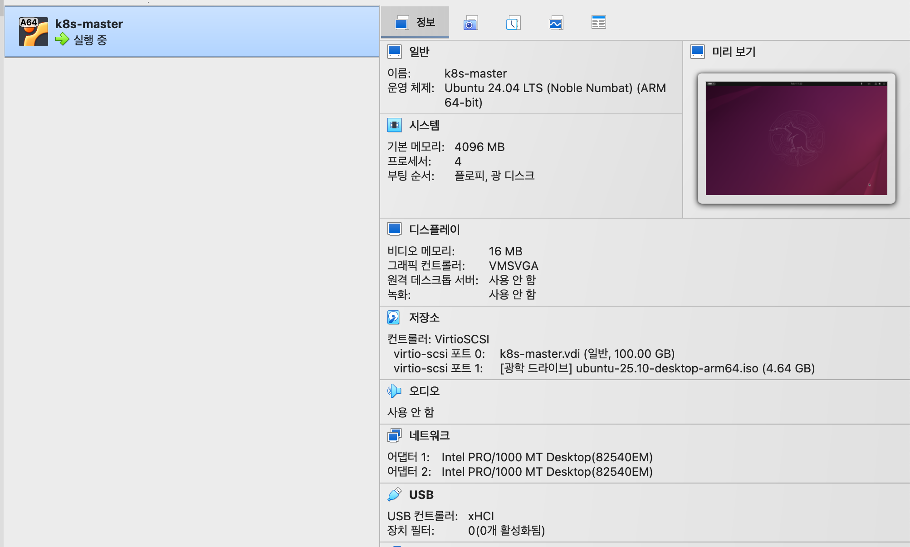
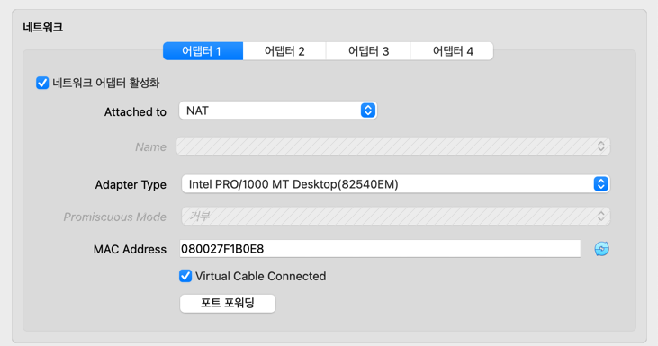
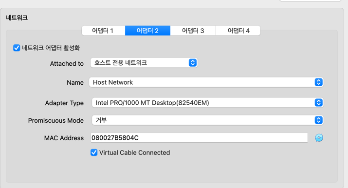
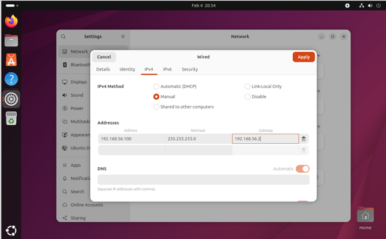
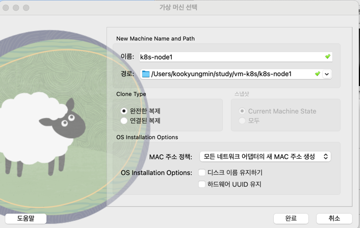

# Kubernetes Study

## 테스트 환경

VM (Ubuntu 24.04) Node 4개 (Master 1, Worker 3)

- k8s-master
- k8s-node1
- k8s-node2
- k8s-node3

## VM 환경 구성

CPU: 4 Core

Memory: 4096MB

Disk: 100GB



내부 네트워크



외부 네트워크



IP : 192.168.56.100 ~ 102

Network Mask : 255.255.255.0

Gateway : 192.168.56.1



## k8s 를 위한 환경 구성

```
# 유용한 패키지 설치
$ sudo apt -y update
$ sudo apt -y install openssh-server vim tree htop
```

```
# 테스트를 위해 방화벽 해제
$ sudo ufw disable
```

```
# Pod 가 Swap 을 사용하지 않도록 하여 성능 유지를 위해 swap 해제
$ sudo swapoff -a
$ sudo sed -i '/ swap / s/^/#/' /etc/fstab
```

```
# chrony 를 통해 시간 동기화
$ sudo apt install chrony
$ chronyc sources -v
```

```
# 네트워크 패킷을 올바르게 포워딩하기 위해 커널에서 IP 포워딩 활성화
$ sudo -i
$ sudo echo '1' > /proc/sys/net/ipv4/ip_forward
```

```
# containerd 를 이용한 container runtime 구성
$ sudo cat <<EOF | sudo tee /etc/modules-load.d/containerd.conf
overlay
br_netfilter
EOF
```

```
# modprobe 프로그램은 요청된 모듈이 동작할 수 있도록,
부수적인 모듈을 depmod 프로그램을 이용하여 검색해 필요한 모듈을 커널에 차례로 등록한다.
$ sudo modprobe overlay
$ sudo modprobe br_netfilter
```

```
# 노드 간 통신을 위한 iptables 에 브릿지 관련 설정 추가
$ sudo cat <<EOF | sudo tee /etc/sysctl.d/99-kubernetes-cri.conf
net.bridge.bridge-nf-call-iptables  = 1
net.ipv4.ip_forward                 = 1
net.bridge.bridge-nf-call-ip6tables = 1
EOF

$ sudo cat <<EOF | sudo tee /etc/modules-load.d/k8s.conf
br_netfilter
EOF

$ sudo cat <<EOF | sudo tee /etc/sysctl.d/k8s.conf
net.bridge.bridge-nf-call-ip6tables = 1
net.bridge.bridge-nf-call-iptables  = 1
net.ipv4.ip_forward                 = 1
EOF

$ sudo sysctl --system
```

```
# k8s runtime 준비 -> containerd 사용
# apt 가 https로 리포지터리를 사용하는 것을 허용하기 위한 패키지 및 docker 에 필요한 패키지 설치

$ sudo apt-get update && sudo apt-get install -y \
apt-transport-https ca-certificates curl gnupg2 software-properties-common
```

```
# 도커 공식 GPG 키 추가
$ sudo install -m 0755 -d /etc/apt/keyrings

$ curl -fsSL https://download.docker.com/linux/ubuntu/gpg \
 | sudo gpg --dearmor -o /etc/apt/keyrings/docker.gpg
 
$ sudo chmod a+r /etc/apt/keyrings/docker.gpg

# arm64 버전 (amd64 인 경우 변경)
$ echo \
"deb [arch=arm64 signed-by=/etc/apt/keyrings/docker.gpg] \
https://download.docker.com/linux/ubuntu \
$(lsb_release -cs) stable" \
| sudo tee /etc/apt/sources.list.d/docker.list > /dev/null

$ sudo apt-get update
```

```
# 도커 관련 패키지 추가
$ sudo apt-get -y install docker-ce docker-ce-cli \
containerd.io docker-buildx-plugin docker-compose-plugin
```

```
# Container.d 관련 설정
$ sudo sh -c "containerd config default > /etc/containerd/config.toml"
$ sudo vi /etc/containerd/config.toml (disabled 된 plugin 이 있는지 확인 -> 없어야함)
$ sudo sed -i 's/ SystemdCgroup = false/ SystemdCgroup = true/g' /etc/containerd/config.toml
$ sudo systemctl restart containerd
```

```
# docker daemon 설정
$ sudo vi /etc/docker/daemon.json
{ 
    "exec-opts": ["native.cgroupdriver=systemd"],
    "log-driver": "json-file",
    "log-opts": {
        "max-size": "100m"
    },
    "storage-driver": "overlay2"
}

$ sudo mkdir -p /etc/systemd/system/docker.service.d
$ sudo usermod -aG docker $USER
$ sudo systemctl daemon-reload
$ sudo systemctl restart docker
$ sudo systemctl restart containerd
$ sudo reboot

$ docker info (Cgroup Driver 가 systemd 로 변경되었는지 확인)
...
 Cgroup Driver: systemd
```

```
# k8s 도구 설치 (1.28.15)

$ curl -fsSL https://pkgs.k8s.io/core:/stable:/v1.28/deb/Release.key \
| sudo gpg --dearmor -o /etc/apt/keyrings/kubernetes-apt-keyring.gpg

$ echo 'deb [signed-by=/etc/apt/keyrings/kubernetes-apt-keyring.gpg] https://pkgs.k8s.io/core:/stable:/v1.28/deb/ /' \
| sudo tee /etc/apt/sources.list.d/kubernetes.list

$ sudo apt update

$ sudo apt -y install kubelet kubeadm kubectl

# 신규 version으로 자동 업데이트를 방지하기 위해 hold
$ sudo apt-mark hold kubelet kubeadm kubectl

$ sudo systemctl daemon-reload
$ sudo systemctl restart kubelet
$ sudo systemctl enable --now kubelet
```

```
# VM 복제 전 ip 및 host 미리 셋팅

$ sudo vi /etc/hosts

...
127.0.1.1 k8s-master
127.0.1.100 k8s-master
127.0.1.101 k8s-node1
127.0.1.102 k8s-node2
127.0.1.103 k8s-node3

# shutdown 후 VM 복제
$ sudo shutdown -h now

# 부팅 후 ip 변경, hostname 변경, /etc/hosts 변경
# 상호 간 ssh 접속

$ ssh $USER@k8s-node1
$ ssh $USER@k8s-node2
```




