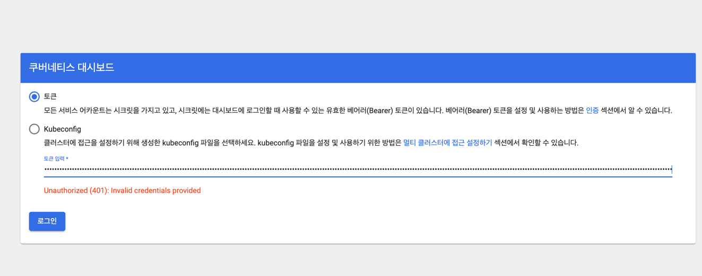
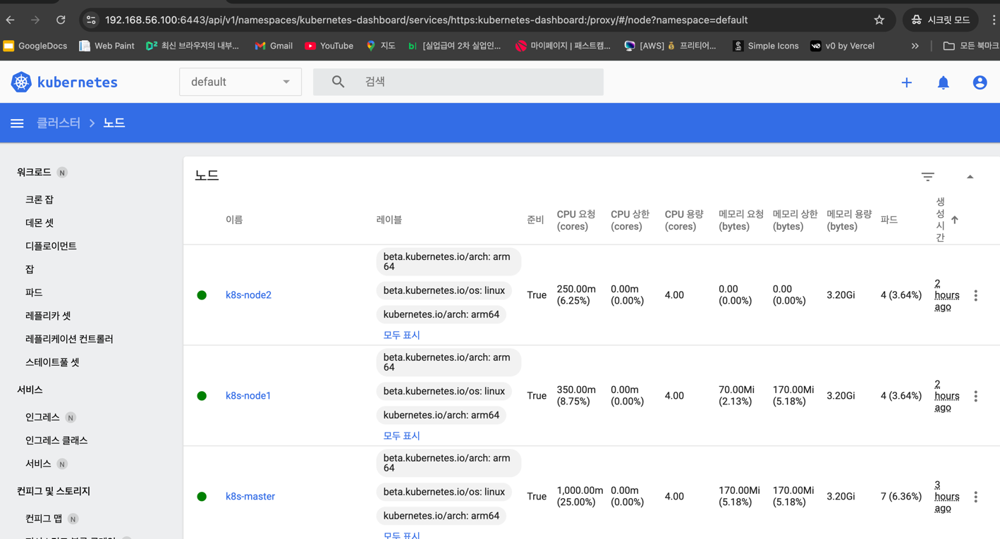
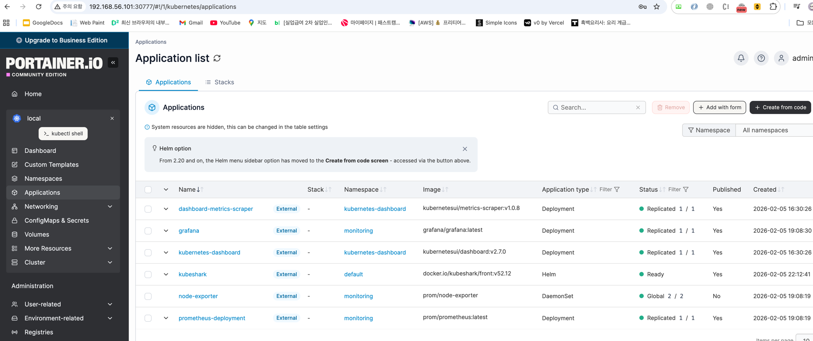
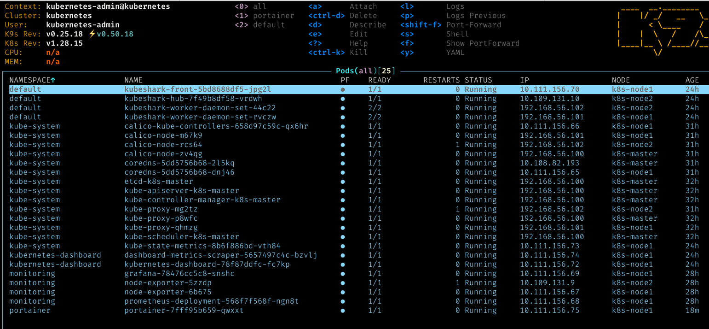

# k8s 관리 도구

## k8s Dashboard

* k8s 클러스터를 위한 범용 웹 기반 UI 제공
* k8s 환경관리, 문제 해결, Monitoring 하는 직관적인 접근 방식 제공 
* 모든 노드에서 메모리 및 CPU 사용량을 포함한 기본 지표에 접근 가능

k8s Dashboard 설치

```
kubectl apply -f https://raw.githubusercontent.com/kubernetes/dashboard/v2.7.0/aio/deploy/recommended.yaml 
```

API Server 를 통한 보안 접속

```
# cluster role 확인
$ kubectl get clusterrole cluster-admin
NAME            CREATED AT
cluster-admin   2026-02-05T05:48:23Z

$ kubectl describe clusterrole cluster-admin
Name:         cluster-admin
Labels:       kubernetes.io/bootstrapping=rbac-defaults
Annotations:  rbac.authorization.kubernetes.io/autoupdate: true
PolicyRule:
  Resources  Non-Resource URLs  Resource Names  Verbs
  ---------  -----------------  --------------  -----
  *.*        []                 []              [*]
             [*]                []              [*]
```
             
```
# dashboard 를 위한 어드민 유저 생성
$ kubectl apply -f dashboard_rbac/dashboard-admin-user.yaml

# cluster-admin 의 권한을 dashboard 어드민 유저 권한에 바인딩
$ kubectl apply -f dashboard_rbac/clusterrolebinding-admin-user.yaml

$ kubectl -n kubernetes-dashboard get sa
NAME                   SECRETS   AGE
dashboard-admin-user   0         2m7s
default                0         13m
kubernetes-dashboard   0         13m

# 어드민 유저로 접근을 위한 token 생성
$ kubectl -n kubernetes-dashboard create token dashboard-admin-user
```

```
# 보안 접속을 위한 인증서 생성 

$ grep 'client-certificate-data' ~/.kube/config | head -n 1 \
| awk '{print $2}' | base64 -d > kubecfg.crt

$ grep 'client-key-data' ~/.kube/config | head -n 1 \
| awk '{print $2}' | base64 -d > kubecfg.key

$ openssl pkcs12 -export -clcerts \
  -inkey kubecfg.key \
  -in kubecfg.crt \
  -out kubecfg.p12 \
  -name "kubernetes-admin" \
  -passout pass:1234

$ sudo cp /etc/kubernetes/pki/ca.crt .
```

```
# 생성한 인증서들 (kubecfg.crt, kubecfg.key, kubecfg.p12, ca.crt) 접속할 PC 로 이동하여 등록
# 접속 PC 에서 실행 (Mac 기준)

# 루트 CA 신뢰
$ sudo security add-trusted-cert \
  -d -r trustRoot \
  -k /Library/Keychains/System.keychain \
  ca.crt
$ security find-certificate -c "CA"

# 개인 인증서 / 키 등록 (Mac 기준)
$ security import kubecfg.crt \
  -k ~/Library/Keychains/login.keychain-db
$ security import kubecfg.key \
  -k ~/Library/Keychains/login.keychain-db \
  -T /Applications/Safari.app \
  -T /Applications/Google\ Chrome.app

```

```
# dashboard 접속

https://192.168.56.100:6443/api/v1/namespaces/kubernetes-dashboard/services/https:kubernetes-dashboard:/proxy/#/login
```




## Prometheus & Grafana

k8s Node 에 DaemonSet 으로 exporter 구현

=> prometheus 에 metric push

=> grafana 로 metric 정보 시각화


k8s service apply

```
# prometheus
kubectl create namespace monitoring
kubectl create -f prometheus/prometheus-ConfigMap.yaml
kubectl create -f prometheus/prometheus-ClusterRoleBinding.yaml
kubectl create -f prometheus/prometheus-ClusterRole.yaml
kubectl create -f prometheus/prometheus-Service.yaml 
kubectl create -f prometheus/prometheus-Deployment.yaml
kubectl create -f prometheus/prometheus-DaemonSet-nodeexporter.yaml

# kube-system
kubectl create -f kube-state/kube-state-ClusterRoleBinding.yaml
kubectl create -f kube-state/kube-state-ClusterRole.yaml
kubectl create -f kube-state/kube-state-ServiceAccount.yaml
kubectl create -f kube-state/kube-state-Deployment.yaml
kubectl create -f kube-state/kube-state-Service.yaml

# grafana
kubectl create -f grafana/grafana-Deployment.yaml
kubectl create -f grafana/grafana-Service.yaml
```

```
$ kubectl get po -n monitoring
NAME                                     READY   STATUS    RESTARTS   AGE
grafana-78476cc5c8-snshc                 1/1     Running   0          112s
node-exporter-5zzdp                      1/1     Running   0          2m3s
node-exporter-6b675                      1/1     Running   0          2m3s
prometheus-deployment-568f7f568f-ngn8t   1/1     Running   0          2m3s
```

prometheus, grafana 접속

```
# prometheus
http://192.168.56.101:30003

# grafana
http://192.168.56.101:30004
```


## Kubeshark

* k8s 의 내부 네트워크에 대한 실시간 프로토콜 수준 가시성 제공
* Container, Pod, Node 및 Cluster 에 들어오고 나가는 모든 트래픽과 페이로드를 캡처하고 모니터링하는 k8s 용 API 트래픽 분석기

```
# helm 설치
$ curl -fsSL https://raw.githubusercontent.com/helm/helm/main/scripts/get-helm-3 | bash

# kubeshark install
$ helm repo add kubeshark https://helm.kubeshark.com
$ helm install kubeshark kubeshark/kubeshark

# kubeshark enable
$ kubectl port-forward -n default svc/kubeshark-front 8899:80 --address=0.0.0.0
```


## Portainer

* 웹 GUI 기반의 컨테이너 관리도구

portainer 설치

```
$ sudo mkdir /DATA1 (k8s-node1)
$ kubectl apply -f portainer-pv.yaml
$ kubectl apply -f https://raw.githubusercontent.com/portainer/k8s/master/deploy/manifests/portainer/portainer.yaml

$ kubectl -n portainer get pv,pvc
NAME                            CAPACITY   ACCESS MODES   RECLAIM POLICY   STATUS   CLAIM                 STORAGECLASS   REASON   AGE
persistentvolume/portainer-pv   10Gi       RWO            Retain           Bound    portainer/portainer                           76s

NAME                              STATUS   VOLUME         CAPACITY   ACCESS MODES   STORAGECLASS   AGE
persistentvolumeclaim/portainer   Bound    portainer-pv   10Gi       RWO                           68s                       11s

$ kubectl get -n portainer po,svc -o wide
NAME                             READY   STATUS    RESTARTS   AGE   IP              NODE        NOMINATED NODE   READINESS GATES
pod/portainer-7fff95b659-qwxxt   1/1     Running   0          89s   10.111.156.75   k8s-node1   <none>           <none>

NAME                TYPE       CLUSTER-IP      EXTERNAL-IP   PORT(S)                                         AGE   SELECTOR
service/portainer   NodePort   10.102.93.124   <none>        9000:30777/TCP,9443:30779/TCP,30776:30776/TCP   89s   app.kubernetes.io/instance=portainer,app.kubernetes.io/name=portainer
```

접속

```
http://192.168.56.101:30777
```




## k9s

* k8s 클러스터를 터미널에서 사용하기 위한 오픈소스 CLI 도구

* 터미널 기반의 UI 를 통해 kubectl 명령어를 입력하지 않아도 직관적으로 작업을 수행할 수 있고, UI 를 xhdgo k8s 의 리소스를 생성, 업데이트, 로깅하고 제거하는 방법 제공

k9s 설치

```
$ wget https://github.com/derailed/k9s/releases/download/v0.25.18/k9s_Linux_arm64.tar.gz
$ tar -zxvf k9s_Linux_arm64.tar.gz
$ sudo mv k9s /usr/local/bin/k9s
$ k9s info
 ____  __.________
|    |/ _/   __   \______
|      < \____    /  ___/
|    |  \   /    /\___ \
|____|__ \ /____//____  >
        \/            \/

Configuration:   /home/koo/.config/k9s/config.yml
Logs:            /tmp/k9s-koo.log
Screen Dumps:    /tmp/k9s-screens-koo
```


