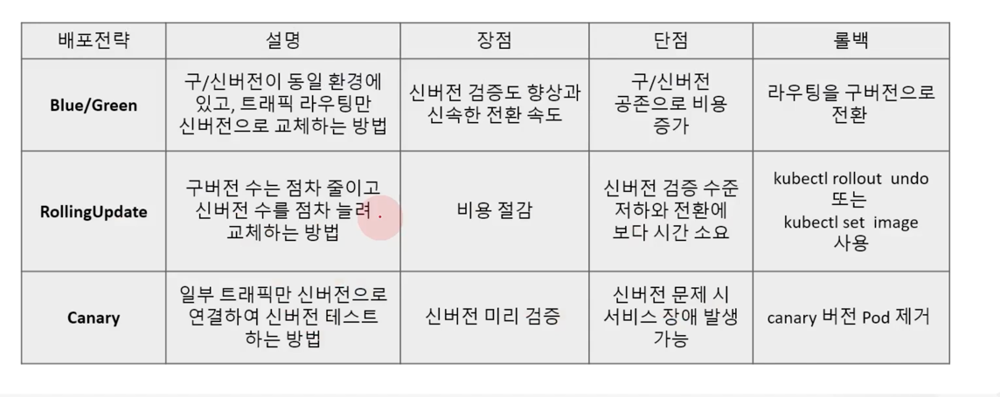
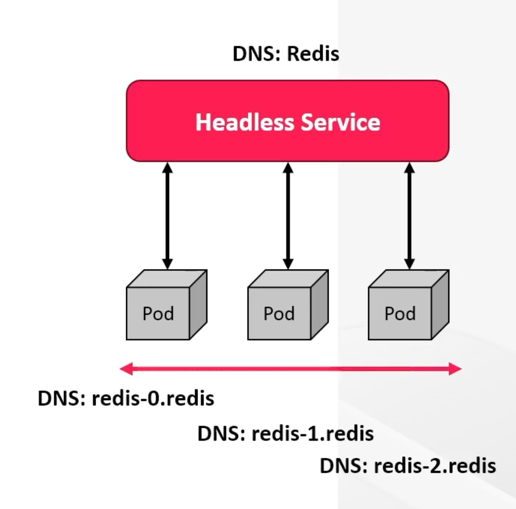

# Pod를 위한 workload resources

## k8s workload resources


* k8s의 workload는 Pod를 중심으로 구동되는 컨테이너 애플리케이션이고,
* 이 애플리케이션의 원하는 상태와 특성을 정의하는 다양한 구성 요소들이 있다.
* Workload resources는 Pod의 Life cycle 관리를 지원해 주는 도구이고, k8s 에는 내장된 다양한 object들이 있고, Controller 를 통해 관리된다.

## Deployments

* Deployments는 k8s 클러스터에서 컨테이너화된 애플리케이션을 관리하기 위한 기본 빌딩 블록 제공
* 애플리케이션 -> 컨테이너 -> Pod -> ReplicaSet -> Deployment
* Deployments는 복제 Pod 집합을 관리, 확장하는 선언적 방법을 제공하는 API resource 로 상위 수준의 추상화 object
* Deployments에서 원하는 상태를 설명하면 Deployments controller가 제어된 속도로 현재 상태를 원하는 상태로 조정


### Deployments 는 왜 사용할까?

* ReplicaSet rollout 을 통해 Pod 복제본 및 Image 버전 관리
* Pod의 지속적 상태 관리 (Desired state management)
* Workload(CPU, Memory usage) 기준 수동 및 자동 확장, 축소 기능 구현 가능(HPA)
* Rolling update를 통한 중단 없는 업데이트 지원
* 다양한 배포 전략을 제공하고 이전 Pod 에서 새로운 Pod로 전환 속도를 제어 가능(strategy)
* 이전 버전으로의 Rollback 지원
* 사용하지 않는 ReplicaSet 관리


### Deployments 생성

* replicas는 Pod 복제본 수 지정
* selector는 Deployment가 관리하는 Pod의 선택기로 어떤 label의 Pod를 선택하여 관리할지에 대한 설정
* template은 새 Pod를 생성하는데 사용되는 Pod template 정의
* strategy는 배포 전략 설정
* template.metadata.labels는 Pod에 적용할 값
* resources를 통해 CPU, Memory의 사용량 제어

```
apiVersion: apps/v1
kind: Deployment
metadata:
  name: example-deployment
spec:
  replicas: 3
  selector:
    matchLabels:
      app: example
  strategy: {} # default rolling update
  template:
    metadata:
      labels: example
    spec:
      containers:
      - name: example-container
        image: example-image
        ports:
        - containerPort: 80
        resources: 
          limits: # 최대
            cpu: 100m
            memory: 128Mi
          requests: # 초기
            cpu: 100m
            memory: 128Mi
```

이미지 업데이트

```
$ kubectl set image deploy example-deployment example-container=example-image:v2
```

변경 내역 조회

```
$ kubectl rollout history deploy example-deployment
```

이미지 롤백

```
$ kubectl rollout undo deploy example-deployment --to-revision=2
```

스케일 변경

```
$ kubectl scale deploy example-deployment --replicas=5
```


### Deployment 배포 전략

* 일반적으로 배포 전략에 따라 애플리케이션이 이전 버전에서 최신 버전으로 업데이트 되는 방식이 결정
* 일부 전략에서는 다운타임이 포함되며, 일부는 테스트 개념을 도입하고 사용자 분석을 가능하게 함 (Recreate, RollingUpdate(default))
* 트래픽 흐름을 다양한 방식으로 제어할 수 있는 고급 배포 전략 사용 (Blue-Green, Canary, A/B Testing)
* RollingUpdate 시 maxSurge는 업데이트 중 기존 replica 수보다 얼마나 더 많이 pod를 잠시 늘릴 수 있는가의 값이고,
maxUnavailable은 업데이트 중 사용 불가능해도 좋은 Pod 수이다.




## StatefulSet

* StatefulSet은 애플리케이션의 상태저장을 관리하는 workload 리소스
* Stateless 애플리케이션은 Deployment로 배포하고, Stateful인 DB 같은 경우는 StatefulSet으로 배포
* StatefulSet 로 실행시킨 Pod는 Deployment와 다르게 같은 순서 값과 안정적인 네트워크 ID를 Pod에 할당
* Pod는 오름 차순으로 생성되고, 다음 Pod는 이전 Pod가 준비되고 실행 상태가 된 후에만 생성된다. 삭제는 반대로 큰 수의 Pod부터 삭제됨
* spec.podManagementPolicy: Parallel -> Pod를 순서 없이 병렬로 실행하거나 종료


* StatefulSet의 각 Pod들은 동일 spec으로 생성되지만 서로 교체는 불가능 즉, re-scheduling 이 되도 지속적으로 동일 식별자 유지
* StatefulSet 애플리케이션은 서버, 클라이언트, 애플리케이션에서 사용할 수 있돌고 영구 볼륨에 데이터 저장 -> StorageClass를 사용한 PVC 사용
* StatefulSet 복제본 증가시 자동으로 PV/PVC 가 생성
* StatefulSet 복제본 축소 시 사용했던 PV/PVC는 삭제되지 않고 유지
* StatefulSet은 Headless service를 사용해야 한다. (Pod를 그룹화하기만 함)
* StatefulSet에서 각 Pod를 개별적으로 식별하고 직접 통신하기 위해 Headless Service가 필요하다.



```
# Headless Service

apiVersion: v1
kind: Service
metadata:
  name: stfs-svc
  labels:
    app: stfs-app
spec:
  clusterIP: None
  ports:
  - port: 8080
    protocol: TCP
  selector:
    app: stfs-app
```

```
# StatefulSet

apiVersion: apps/v1
kind: StatefulSet
metadata:
  name: stfs-app
spec:
  serviceName: stfs-svc
  selector:
    matchLabels:
      app: stfs-app
  replicas: 2
  template:
    metadata:
      labels:
        app: stfs-app
    spec:
      ...
  volumeClaimTemplates:
   - metadata:
       name: data
     spec:
      resources:
         requests:
           storage: 1Gi
         accessModes:
         - ReadWriteOnce
         storageClassName: openebs-hostpath
```

## DaemonSet

* DaemonSet 은 Deployment와 유사하지만 Replicas 옵션은 없다.
* 이는 DaemonSet이 노드 단위 배포이고, 노드의 백그라운드에서 항상 Pod를 데몬으로 실행할 수 있게 해주는 workload resources라는 것이다.
* DaemonSet은 모든 노드에서 백그라운드로 항상 실행되어야 하는 업무를 수행하는데에 적합
* 모니터링 시스템, 로그 수집 에이전트, 노드 데이터 백업과 같은 장기간 지속되는 작업
* Taint와 Toleration 옵션 혹은 nodeSelector을 사용하여 특정 노드에 배포 선택 가능


DaemonSet 업데이트 전략의 기본은 RollingUpdate (또는 OnDelete)

* onDelete 이전 데몬이 종료된 경우에만 교체
* RollingUpdate 롤링을 사용하여 이전 데몬을 새 데몬으로 교체


## Job & CronJob 활용


