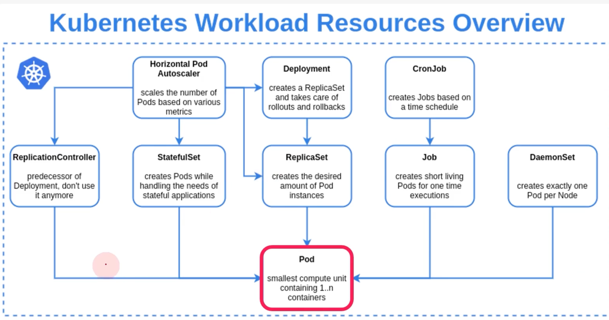

# Pod를 위한 workload resources

## k8s workload resources



* k8s의 workload는 Pod를 중심으로 구동되는 컨테이너 애플리케이션이고,
* 이 애플리케이션의 원하는 상태와 특성을 정의하는 다양한 구성 요소들이 있다.
* Workload resources는 Pod의 Life cycle 관리를 지원해 주는 도구이고, k8s 에는 내장된 다양한 object들이 있고, Controller 를 통해 관리된다.

## Deployments

* Deployments는 k8s 클러스터에서 컨테이너화된 애플리케이션을 관리하기 위한 기본 빌딩 블록 제공
* 애플리케이션 -> 컨테이너 -> Pod -> ReplicaSet -> Deployment
* Deployments는 복제 Pod 집합을 관리, 확장하는 선언적 방법을 제공하는 API resource 로 상위 수준의 추상화 object
* Deployments에서 원하는 상태를 설명하면 Deployments controller가 제어된 속도로 현재 상태를 원하는 상태로 조정


### Deployments 는 왜 사용할까?

* ReplicaSet rollout 을 통해 Pod 복제본 및 Image 버전 관리
* Pod의 지속적 상태 관리 (Desired state management)
* Workload(CPU, Memory usage) 기준 수동 및 자동 확장, 축소 기능 구현 가능(HPA)
* Rolling update를 통한 중단 없는 업데이트 지원
* 다양한 배포 전략을 제공하고 이전 Pod 에서 새로운 Pod로 전환 속도를 제어 가능(strategy)
* 이전 버전으로의 Rollback 지원
* 사용하지 않는 ReplicaSet 관리


### Deployments 생성

* replicas는 Pod 복제본 수 지정
* selector는 Deployment가 관리하는 Pod의 선택기로 어떤 label의 Pod를 선택하여 관리할지에 대한 설정
* template은 새 Pod를 생성하는데 사용되는 Pod template 정의
* strategy는 배포 전략 설정
* template.metadata.labels는 Pod에 적용할 값
* resources를 통해 CPU, Memory의 사용량 제어

```
apiVersion: apps/v1
kind: Deployment
metadata:
  name: example-deployment
spec:
  replicas: 3
  selector:
    matchLabels:
      app: example
  strategy: {} # default rolling update
  template:
    metadata:
      labels: example
    spec:
      containers:
      - name: example-container
        image: example-image
        ports:
        - containerPort: 80
        resources: {}
```

이미지 업데이트

```
$ kubectl set image deploy example-deployment example-container=example-image:v2
```

변경 내역 조회

```
$ kubectl rollout history deploy example-deployment
```

이미지 롤백

```
$ kubectl rollout undo deploy example-deployment --to-revision=2
```

