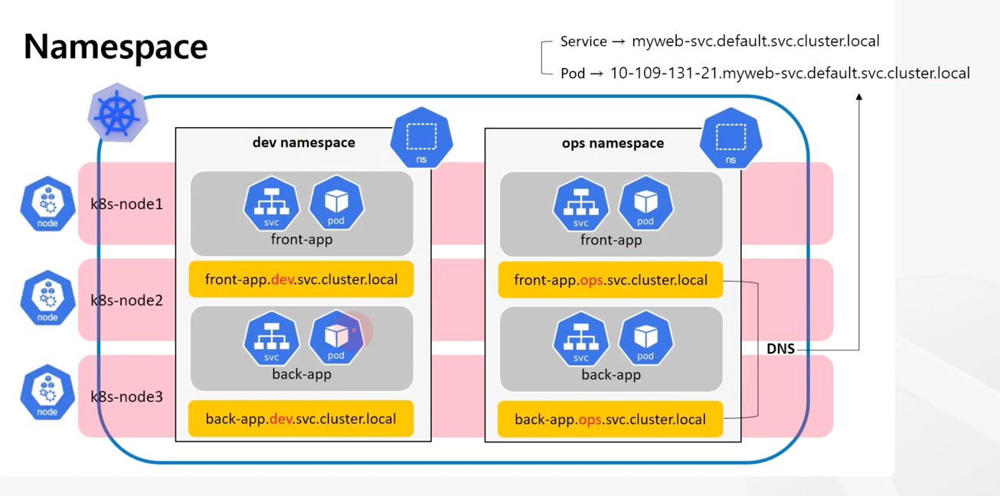
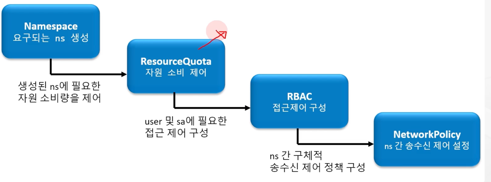
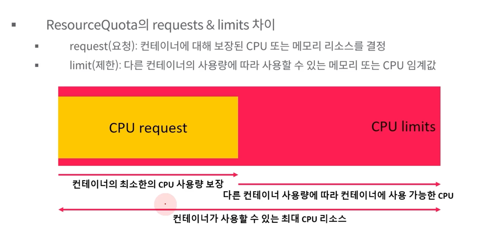
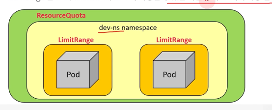

# Namespace



* namespace(ns) 는 k8s cluster 내에서 리소스(Pod, Service 등)을 구분(격리)하기 위한 가상의 논리적 공간(그룹, 파티셔닝) 을 제공
* 서비스(애플리케이션, 팀, 환경 등 목적에 따른 구분) 단위의 namespace 구분은 전체 프로젝트 운영, 관리 등의 측면에서 유리
* 개발 / 테스트 / QA / 운영 등의 목적에 따른 ns 구분
* ns를 통해 격리할 수 있기 떄문에 애플리케이션들을 서로 간섭없이 실행 가능
* DNS -> <service-name>.<namespace-name>.svc.cluster.local
* namespace 별 접근제어(RBAC) 및 자원 소비 제어(ResourceQuota 등) 설정 가능

coredns 의 cluster ip를 nameserver로 등록해주면 host 에서도 DNS로 접근 가능 (ping 은 안됨)

```
$ kubectl get svc -n kube-system kube-dns
NAME       TYPE        CLUSTER-IP   EXTERNAL-IP   PORT(S)                  AGE
kube-dns   ClusterIP   10.96.0.10   <none>        53/UDP,53/TCP,9153/TCP   9d

$ sudo vi /etc/resolv.conf
nameserver 10.96.0.10
```





기본 namespace 변경 방법

```
$ kubectl config set-context --current --namespace=dev-ns
```

kubens 명령 활용

```
$ vi kubens
$ sudo cp kubens /usr/local/bin/
$ chmod +x /usr/local/bin/kubens

$ kubens dev-ns  # change ns
$ kubens -c # current ns
```

## ResourceQuota

* ResourceQuota는 하나의 공유 k8s 클러스터에서 여러 팀, 여러 프로젝트가 진행 중인 환경에서 유용
* 하나의 Pod 애플리케이션이 많은 리소스를 독점하는 경우 상대적으로 다른 애플리케이션의 성능에 영향을 미치는 것을 방지
* Namespace 당 총 리소스 사용을 제한하는 제약 조건을 제공
* 유형별로, ns에서 생성 할 Pod 수와 해당 프로젝트에서 사용할 수 있는 리소스의 총 compute(CPU, Memory) 양을 제한
* Pod 입장에서 자원이 부족해 문제가 발생할 수 있지만, 다른 Namespace에 있는 Pod에는 영향을 주지 않음




```
apiVersion: v1
kind: ResourceQuota
metadata:
  name: rq-1
  namespace: dev-ns
spec:
  hard:
    requests.cpu: "1000m"
    requests.memory: "1Gi"
    limits.cpu: "2000m"
    limits.memory: "2Gi"
    services: 5
    pods: 5
```


## LimitRange

* LimitRange는 개별 pod, container 단위로 cpu와 memory 제한을 주거나 기본값을 설정
* 이는 ResourceQuota 가 있더라도 언제나 Namespace 범위에서의 cpu, memory 제한이기 때문에 하나의 pod가 모든 자원 사용도 가능
* LimitRange 생성 시 Namespace 에서 하나의 pod, container 가 너무 많은 자원을 소모하지 못하게 제한



```
apiVersion: v1
kind: LimitRange
metadata:
  name: lr-1
  namespace: dev-ns
spec:
  limits:
  - type: Container
    default:
      cpu: "1"
      memory: "512Mi"
    max:
      cpu: "2"
    min:
      cpu: "200m"
    defaultRequest:
      cpu: 0.5
      memory: 256Mi
  
```


