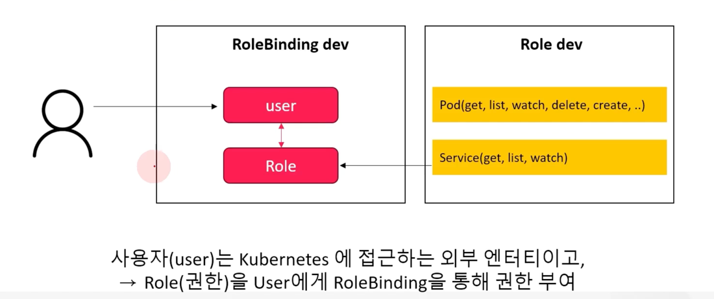
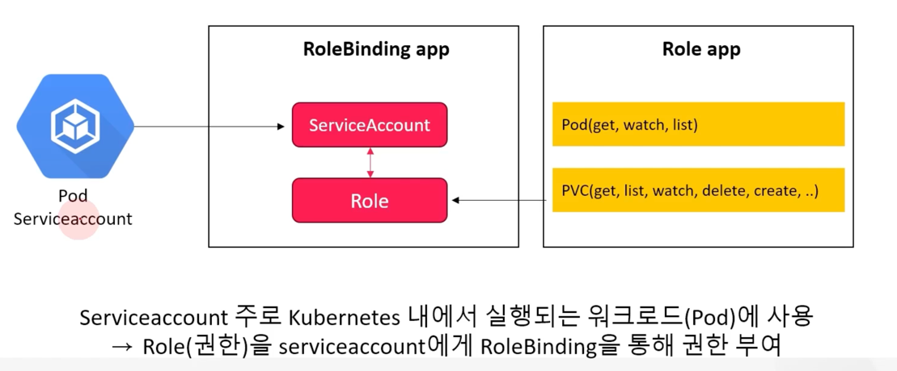
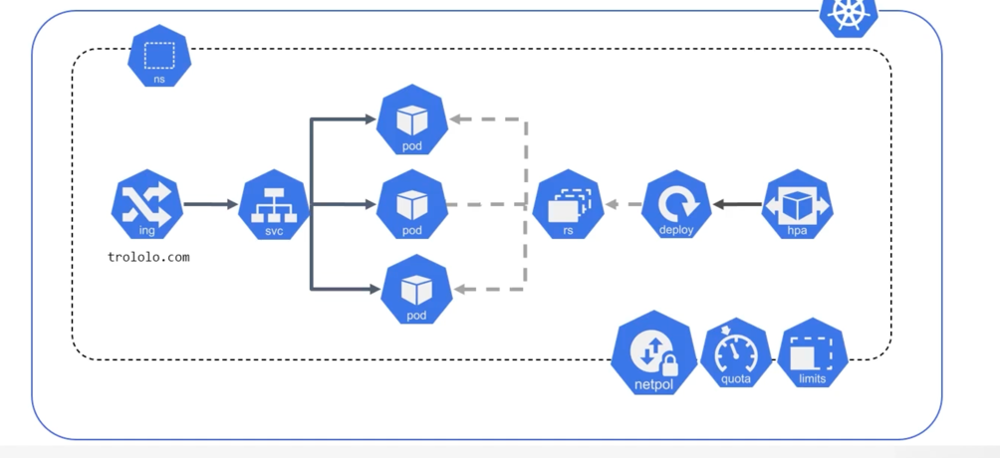

# k8s 기본 보안 구성

## k8s 기본 보안

*  k8s 접근 제어의 기본은 Authentication 과 Authorization 이다.
* Authentication : 요청자가 k8s 사용자인지 검증
* Authorization : 요청자가 요청한 기능에 대한 권한을 가지고 있는지 검증
* k8s admission control system (승인 제어 시스템) 은 요청을 확인하고 수정할 수 있고,
요청을 최종 거부하거나 수락할 수 있다.
* Network Policy를 이용하여 서로 다른 namespace 간의 모든 Pod 들의 연결 규칙, ingress rule 정의 함 (calico 같은 Network Plugin 이용)


### k8s 접근제어

* network 를 통해 API 서버에 도달하는 요청은 TLS 를 사용하여 암호화
* SSL 인증서를 통해 구성되는 이 작업은 kubeadm init 시 자동으로 구성됨


api-server 에 안전하게 요청이 전달되면 

1. authentication module : 인증에 실패하면 요청 거부, 성공하면 권한 부여
2. authorization module : 기존 정책과 비교 검증하거나 사용자가 요청 작업을 수행할 권한이 있는 경우 권한 사용 허가
3. admission controller system module : 생성 중인 객체의 실제 내용을 확인하고 요청을 승인하기전에 유효성 검사 


* k8s 는 ServiceAccounts 와 Users 모두 인증과 인가 부여에 사용되는 엔티티이지만 서로 다른 용도로 사용
* RBAC 정책을 ServiceAccounts 와 Users 모두에 적용하여 클러스터 내의 리소스에 대한 엑세스를 제어할 수 있다.
* RBAC(Role Based Access Control) -> 최소 권한의 원칙 적용
* API 서버에 임의의 사용자가 요청을 차단하기 위해 API 요청을 승인하기 위해서는 Role 기반의 인증 작업 요구


### k8s RBAC

* Role & ClusterRole, RoleBinding & ClusterRoleBinding 로 RBAC 구현
* 예로 Pod : RBAC 은 특정 Pod 에 대한 엑세스를 제한하거나 사용자가 수명 주기를 관리하도록 허용
* Deployment : RBAC 은 배포 관리에 대한 엑세스 권한을 부여하여 승인된 사용자만 변경할 수 있도록 허용
* Service : RBAC 은 서비스에 대한 엑세스를 제어하여 특정 사용자가 서비스를 생성, 업데이트 또는 삭제할 수 있돌고 허용 





```
apiVersion: v1
kind: ServiceAccount
metadata:
  name: admin-user
  namespace: kubernetes-dashboard
```

```
apiVersion: rbac.authorization.k8s.io/v1
kind: ClusterRoleBinding
metadata:
  name: admin-user
roleRef:
  apiGroup: rbac.authorization.k8s.io
  kind: ClusterRole
  name: cluster-admin
subjects:
- kind: ServiceAccount
  name: admin-user
  namespace: kubernetes-dashboard
```

service account 생성

```
$ kubectl create ns dev-ns
$ kubectl create sa dev-sa -n dev-ns
$ kubectl -n dev-ns create deployment sa-test-deploy --image=nginx --port=80 --dry-run=client -o yaml > sa-test-deploy.yaml

$ vi sa-test-deploy.yaml

...
spec:
  serviceAccountName: dev-sa
  ...
  
$ kubectl apply -f sa-test-deploy.yaml
```

권한 부여

```
apiVersion: rbac.authorization.k8s.io/v1
kind: Role
metadata:
  namespace: dev-ns
  name: sa-test-role
rules:
- apiGroups: [""]
  resources: ["pods"]
  verbs: ["get", "watch", "list"]
---
apiVersion: rbac.authorization.k8s.io/v1
kind: RoleBinding
metadata:
  name: sa-test-rolebinding
  namespace: dev-ns
roleRef:
  apiGroup: rbac.authorization.k8s.io
  kind: Role
  name: sa-test-role
subjects:
- kind: ServiceAccount
  name: dev-sa
  namespace: dev-ns
```

## Role & ClusterRole

* 모든 리소스는 모델링된 API 개체이므로 CRUD 작업을 통해 수정 가능
* RBAC은 규칙 또는 하나 이상의 작업 집합이 객체에 작용하도록 구성 (Namespace, API 그룹, 개체 및 작업의 일부 조합과 같은 세분화된 방식으로 구성)
* Role은 단일 Namespace 내에서 할당할 수 있는 규칙 모음이고, ClusterRole은 모든 Namespace 에서 규칙을 유효하게 사용 가능한 규칙 모음
* Role을 subjects(주제) 와 연결하기 위해 하나 또는 모든 Namespace에 바인딩되는 RoleBinding, ClusterRoleBinding 사용
* Namespace 내부의 Role, RoleBinding 구성 시 token 생성
* Token을 통해 외부에서 API 서버 접근 가능, 단, namespace 안에서 인가된 권한만 사용가능

권한 여부 확인

```
$ kubectl -n [namespace] auth can-i [resource] [action] --as=[serviceaccount]
yes or no
```

## Network Policy

* NetworkPolicy는 네트워크 트래픽이 흐르는 방식을 정의하는 규칙 집합
* Pod 내부로 수신(Ingress)되거나 외부로 송신(Egress) 되는 트래픽을 허용하고 거부하는 정책을 설정
* 일반적으로 Pod와 Service 간의 통신을 제어하고 보호하는데 사용
* NetworkPolicy는 Whitelist 형식으로 구성되어 있기 때문에 명시해 놓은 목록 외에는 대상 Pod에 트래픽 전송 불가
* NetworkPolicy 트래픽 제어는 네트워크 플러그인으로 구현(CNI) -> calico
* NetworkPolicy는 Namespace level의 트래픽 흐름 제어다.
* [] 은 모든 트래픽 거부, {} 은 모든 트래픽 허용




```
apiVersion: networking.k8s.io/v1
kind: NetworkPolicy
metadata:
  name: test-network-policy
  namespace: dev-ns
spec:
  podSelector: # NetworkPolicy 가 적용될 Pod 선택
    matchLabels:
      role: db
  policyTypes: # 적용될 트래픽 방향을 설정, Ingress/Egress 를 적지 않으면 all deny
  - Ingress # Pod로 들어오는 네트워크 트래픽 제한 (from)
  - Egress # Pod에서 네트워크 트래픽을 내보내는 방법 제어 (to)
  ingress: 
  - from: 
    - ipBlock:
        cidr: 172.17.0.0/16
        except:
        - 172.17.1.0/24
    - namespaceSelector:
        matchLabels:
          project: myproject
    - podSelector: # 수신을 허용하는 Pod의 label
        matchLabels:
          role: frontend
  ports:
   - protocol: TCP
     port: 6379
   egress:
    - to:
      - ipBlock:
          cidr: 10.0.0.0/24
    ports:
      - protocol: TCP
        port: 5978
```


