# Kubernetes 아키텍처

## kubernetes 구조 

kubernetes 클러스터는 하나 이상의 control plane(master node) 와 하나 이상의 data plane(worker node) 로 구성

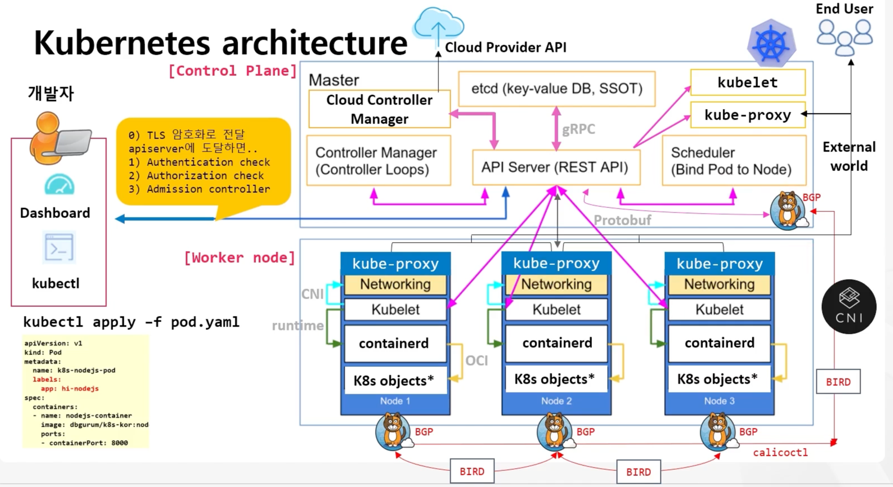

Master 는 Controller Manager, API Server(REST API), etcd(key-value DB), Scheduler(Bind Pod To Node) 등으로 구성

- kube-apiserver : 모든 요청의 진입점 (REST API)
- etcd : 모든 Kubernetes 상태 저장소 (key-value DB)
- kube-scheduler : Pod를 어떤 Node에 배치할지 결정
- kube-controller-manager : desired state ↔ current state 맞추는 컨트롤 루프들

Worker Node 는 CNI(calico ..), kube-proxy, kubelet, containerd, k8s objects(Pod) 로 구성

- CNI plugin : Pod ↔ Pod / Pod ↔ 외부 네트워크
- kubelet : 노드 에이전트, PodSpec을 받아 컨테이너 실행/상태 보고
- container runtime : containerd / CRI-O / (옛날 docker)
- kube-proxy : Service 트래픽 처리 (iptables / ipvs)
- CoreDNS : DNS 기반 Service Discovery 기능 제공
- Pods : 실제 워크로드가 여기서 실행됨


## k8s worker node 구성요소

### kubelet

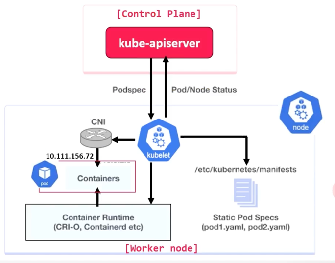

* Control plane 및 worker node 모두 존재
* Pod 실행(생성, 변경, 삭제) 를 위해 Control plane의 API 서버와 통신 수행
* Worker node를 API 서버에 등록하고, API 서버에서 PodSpec 을 받아서 처리하는 에이전트 역할
* liveliness(살아있는지), readiness(준비가 되었는지), startup probes 기능 처리
* Node의 Container runtime을 사용하여 image 를 가져오고 컨테이너를 실행하는 등의 작업 수행
* container를 관리하고 Pod가 원하는 상태인지 확인하는데 중요

### kube-proxy

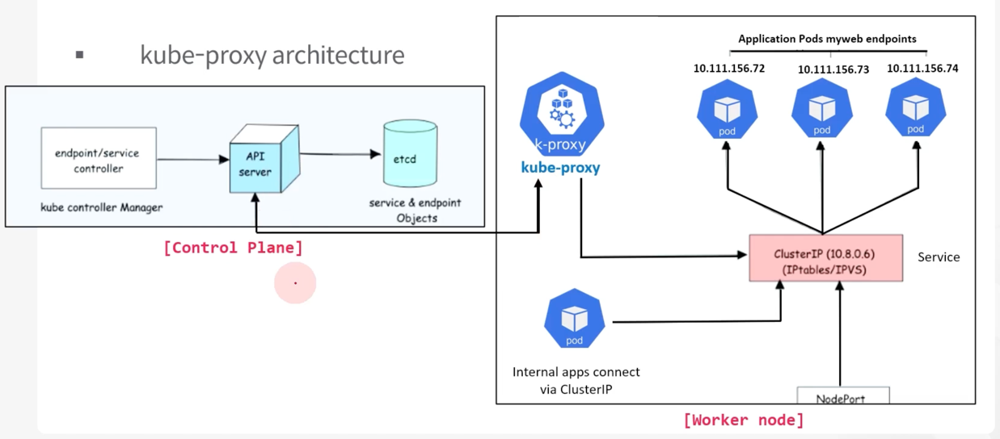

* Service object는 Pod를 트래픽에 노출, Endpoint object에는 Pod IP 주소와 port 포함
  (kube-proxy는 Pod용 Service 구현체)
* Service를 사용하여 Pod를 노출하면 kube-proxy는 Service object와 그룹화된 Pod로 트랙픽을 보내는 네트워크 규칙 생성(iptables)
* kube-proxy는 UDP,TCP,SCTP 프로토콜을 Proxy, HTTP는 no Proxy
  (모든 노드에서 DaemonSet 으로 실행)
* kube-proxy는 API 서버와 통신, 서비스와 해당 PodIP, Port 에 대한 세부 정보를 가져옴
* Service 변경 사항 및 EndPoint 모니터링 후 다양한 Mode를 사용하여 Service에 연결된 Pod로 트래픽을 Routing 하기 위한 규칙(Rule)을 생성
* Mode에는 IPtables, IPVS 포함
* IPtables 모드를 사용하는 경우 kube-proxy는 IPtables 규칙으로 트래픽을 처리하고 로드밸런싱을 위해 백엔드 Pod를 Random 선택

### Container Runtime(Containerd 등)

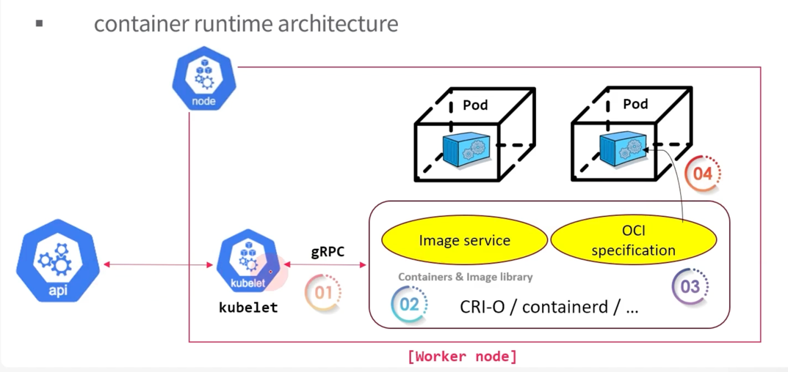

* container runtime은 컨테이너 레지스트리에서 이미지 가져오기, 컨테이너에 대한 리소스 할당 및 격리, 호스트에서 컨테이너의 전체 수명 주기 관리 등 작업 수행
* k8s는 컨테이너 생성, 시작, 중지, 삭제와 이미지 및 컨테이너 네트워크 관리를 위한 API 를 정의하는 CRI 를 통해 Cotainer runtime 과 상호작용
* OCI(Open Container Initiative)는 컨테이너 형식 및 런타임에 대한 표준 집합 (runc 등) => 커널과 통신하여 실제 컨테이너 생성
* kubelet은 CRI API를 사용하여 Container Runtime과 상호작용하여 컨테이너의 Lifecycle를 관리하고 모든 컨테이너 정보를 Control Plane에 제공


## k8s control plane 구성요소

### kube-apiserver

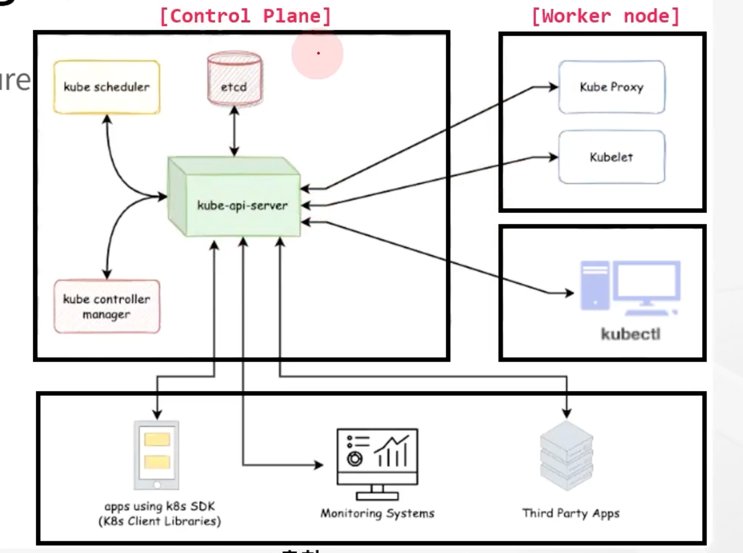

* kube-apiserver 는 k8s API 를 사용하는 k8s 클러스터의 중앙 관리 도구
* API 요청을 관리하고, API 객체에 대한 요청 처리 및 Pod 등의 데이터 유효성 검사 (admission controller)
* 사용자에 대한 인증 및 권한 평가(RBAC)을 통해 승인 제어
* etcd와 통신하는 유일한 구성 요소
* Control plane과 worker node 구성요소 간의 모든 작업 조정


* 여러 Control plane 구성요소와 통신하고 모니터링 및 타사 서비스와도 통신 가능
* kubectl 시 HTTP Request(HTTP REST API) 를 통해 kube-apiserver와 통신
* 내부 구성요소인 스케줄러, 컨트롤러 등과는 gRPC를 사용하여 kube-apiserver와 통신
* kube-apiserver와 클러스터의 다른 구성요소 간의 통신은 클러스터에 대한 무단 액세스를 방지하기 위해 TLS 를 통해 진행


### etcd (key-value 기반의 오픈소스 data storage)

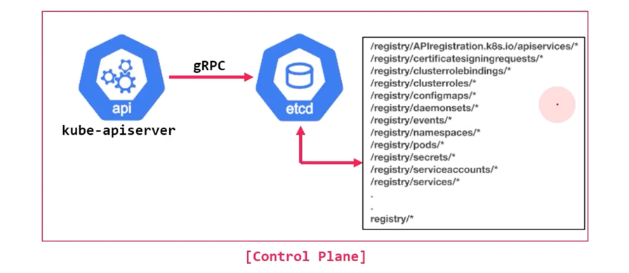

* 모든 클러스터 관련 정보는 etcd 내에 재정의가 아닌 추가를 통해 저장(SSOT, 애플리케이션 데이터 제외)
* 공간 활용율을 높이기 위해 주기적으로 압축(or 파쇄) 수행
* B+Tree 구조로 BboltDB 위에 구축
* 보안을 위한 암호화 기능 제공


* k8s 객체(Pod, Deployment, Secret 등)의 모든 구성 및 상태, 메타데이터 저장
* API 서버는 etcd의 감시기능을 사용하여 객체 상태의 변화를 추적
  (etcd client 가 API 를 사용하여 event를 구독)
* control plane의 유일한 StatefulSet 구성 요소
* gRPC를 사용하여 키-값 API를 노출, API 서버와만 유일하게 통신
* /registry 디렉터리 키 아래의 모든 객체를 키-값 형식으로 저장


* Node 업데이트 시 강력한 일관성을 통해 클러스터의 다른 모든 Node에 즉시 업데이트
* 일관성을 유지하면서 여러 노드에서 클러스터로 실행되도록 설계
* leader-member 구성으로 고가용성 유지 (leader 선 기록 후 member에 복제)
* Raft 합의 알고리즘 기반으로 leader 선출

### kube-scheduler

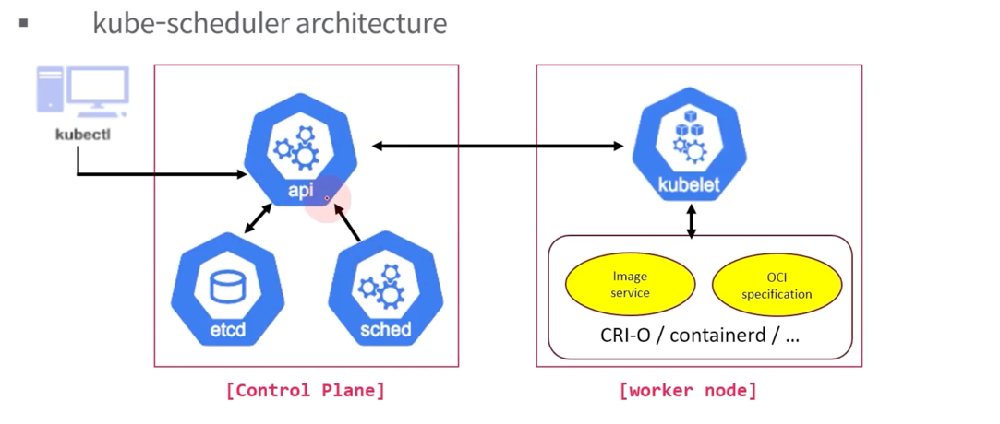

* kube-scheduler 는 worker node에 k8s pod 스케쥴링(예약, 할당) 담당
* API 서버에서 Pod 생성 이벤트를 수신하는 컨트롤러
* Pod 배포 시 CPU, 메모리, 선호도, 오염, 허용 범위, 우선순위, 영구 볼륨 등과 같은 Pod 요구사항 지정
* Pod 생성 요청을 식별하여 가장 적합한 Node를 선택하는게 주요 업무

kube-scheduler 동작 방식

1. kubectl 등을 통해 Pod 생성 요청을 kube-apiserver에게 전달
2. kube-apiserver는 요청 정보를 etcd 에 기록 (pod state)
3. client 에게 요청 승인 알림
4. scheduler 는 할당을 위해 node의 정보를 kube-apiserver에게 요청, etcd에 기록 (pod state)
5. filtering 을 통해 적합한 노드를 선택하고, scoring 을 통해 노드에 점수를 할당하여 노드 순위 지정, 순위가 높은 노드 선택 (동일 시 랜덤 지정)
6. pod 할당을 위해 kube-apiserver는 지정된 Node의 kubelet 에게 Pod 생성 요청
7. kubelet은 해당 Node의 Container Runtime에게 container 시작 요청
8. kublet은 생성 상태를 kube-apiserver에게 Bind pod to Node 알림
9. kube-apiserver는 etcd 에 기록(pod state)

### kube-controller-manager

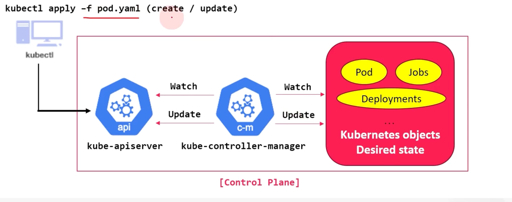

* 무한 제어 루프를 실행하는 프로그램으로 모든 k8s 컨트롤러를 관리하는 구성요소
* 지속적으로 실행되며 객체의 현재 상태와 원하는 상태를 감시
* k8s의 대부분의 resource object는 controller 에 의해 관리

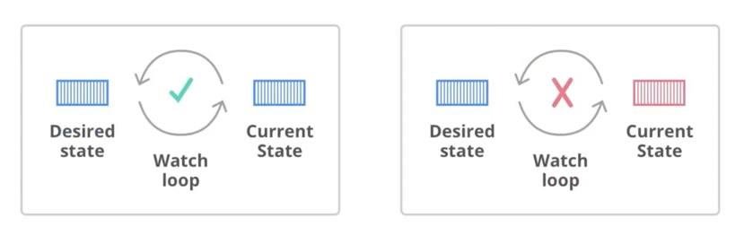


## Pod를 통한 구조 검증 전체 흐름 정리 

```
kubectl run <pod-name> --image=<image-name> ... or kubectl apply -f <yaml-file>
```

1) 이 요청은 Control Plane 의 API 서버에 의해 검증(인증, 인가 ...)
2) 검증이 완료되면 API 서버는 요청을 etcd에 저장하고, Scheduler 에 전달한다.
3) Scheduler는 API 서버에 클러스터 관련 정보를 요청하고, API 서버는 etcd 저장소에서 해당 정보를 읽어 Scheduler 에게 전달한다.
4) 정보를 받은 Scheduler는 해당 정보를 기반으로 Score를 계산하고 Score가 높은 노드에 Pod 를 할당하고 이 메시지를 API 서버에 전달한다.
5) API 서버로부터 요청을 받은 노드의 kubelet은 CRI(Container Runtime Interface)를 통해 컨테이너 런타임(OCI(Open Container Initiative -> 커널 통신)과 상호 작용하여 노드에서 Pod가 생성, 실행됨

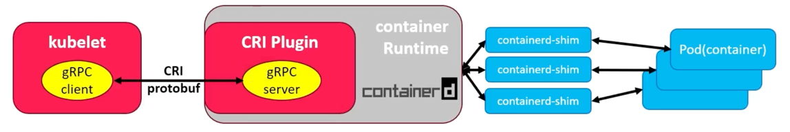

6) Pod 가 실행되는 동안 Controller Manager는 원하는 클러스터 상태(Desired State) 가 Kubernetes 클러스터의 실제 상태(Current State)와 일치하는지 지속적으로 확인


## k8s Node 가용성 유지

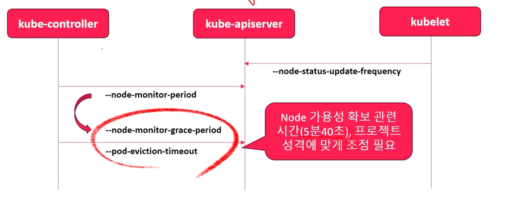

### kubelet

- node-status-update-frequency : 기본 10s(api-serer 에 노드의 상태를 게시하는 주기)
- node-status-report-frequency : 기본 5m

### controller-manager

- node-monitor-period : 기본 5s (node-controller 에 node status를 동기화하는 시간)
- node-monitior-grace-period : default 40s (node로부터 해당 시간 동안 응답을 받지 못한 경우 상태를 Not Ready로 변경)
- pod-eviction-timeout : 기본 5m (노드에서 Pod를 삭제하기 위한 대기 시간)


