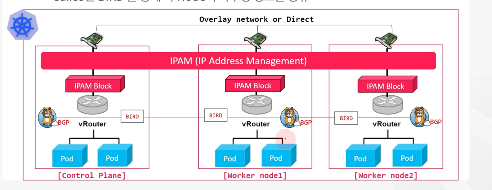
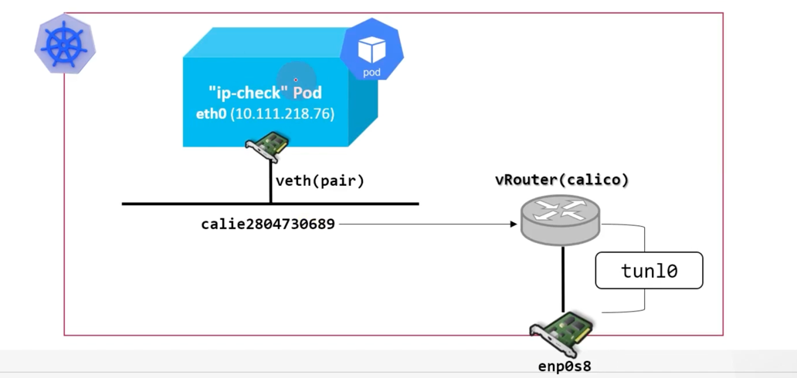

# Kubernetes CNI Calico 실습

## CNI(Container Network Interface)

* CNI는 컨테이너 간의 네트워킹을 제어할 수 있는 Plugin 기반 Network architecture
* 다양한 형태의 container runtime 과 orchestrator 사이의 네트워크 계층을 구현하는 공통된 인터페이스를 제공
* k8s는 Pod 간의 통신을 위해서 CNI 사용
* k8s는 기본적으로 kubenet 이라는 자체적인 CNI Plugin을 제공하지만 네트워크 기능이 매우 제한적이라 3rd-party plugin 제공


* 각 Node에 존재하는 Container Network의 IP 대역이 동일하여 Pod들이 같은 IP를 할당 받을 가능성이 높음
* Pod의 IP 가 다르게 할당되었다 하더라도 해당 Pod가 어느 Node에 존재하는지 확인 불가 (자신의 Node에 있는 Pod Ip 만 식별 가능하므로)
* 따라서, 중복되지 않는 IP를 부여해줄 CNI Plugin 필요
* CNI Plugin은 모든 worker node에게 중복되지 않는 subnet(CIDR) 부여, worker node에 할당된 Pod는 해당 subnet에 포함된 IP를 제공받음


* CNI는 Pod 생성 ~ 삭제 시마다 호출되는 API의 규격과 인터페이스를 정의


### CNI 구성 시

* CNI 가 Bridge Interface를 만들고, 컨테이너 네트워크 대역대를 나누어 routing table 생성
* Pod들은 CNI에 의해 제공되는 고유의 IP 보유
* 클러스터 내의 모든 Pod들은 내부 네트워크가 자동으로 구성되어 Service 없이도 Pod간 통신이 가능
* CNI Provider는 VXLAN(Virtual Extensible LAN), IP-in-IP 과 같은 캡슐화된 네트워크 모델 또는, BGP(Border Gateway Protocol)과 같은 캡슐화 되지 않은 네트워크 모델을 사용하여 네트워크 모델 구현


## CNI: calico



* calico는 k8s CNI 인터페이스를 준수한 k8s 네트워크 모델로서 pod, 노드, 외부 네트워크 등 k8s 리소스의 네트워크 통신 담당
* calico는 vRouter(가상 라우터)를 구현하고 BGP(Border Gateway Protocol) 을 이용, 라우팅 정보를 공유하여 pod, service 네트워크 수행
* 외부 pod 통신은 overlay 또는 Direct 로 통신
* calico 에 대한 라우팅 정보 등을 etcd 에 저장
* calico 는 각 node에게 중복되지 않는 subnet(CIDR) 부여, node에 할당된 Pod는 해당 subnet에 포함된 IP를 제공 받음, 이를 관리하기 위해 IPAM(IP Address Management) 구성요소 사용
* calico 는 BIRD 를 통해 각 Node의 라우팅 정보를 공유

## calicoctl

### calicoctl 설치

```
$ kubectl apply -f https://docs.projectcalico.org/archive/v3.17/manifests/calicoctl.yaml
$ kubectl get po -n kube-system calicoctl -o wide
NAME        READY   STATUS    RESTARTS   AGE   IP               NODE        NOMINATED NODE   READINESS GATES
calicoctl   1/1     Running   0          24s   192.168.56.101   k8s-node1   <none>           <none>

$ kubectl exec -n kube-system calicoctl -- calicoctl -h
Usage:
  calicoctl [options] <command> [<args>...]

    create       Create a resource by file, directory or stdin.
    replace      Replace a resource by file, directory or stdin.
    apply        Apply a resource by file, directory or stdin.  This creates a resource
                 if it does not exist, and replaces a resource if it does exists.
    patch        Patch a pre-exisiting resource in place.
    delete       Delete a resource identified by file, directory, stdin or resource type and
                 name.
    get          Get a resource identified by file, directory, stdin or resource type and
                 name.
    label        Add or update labels of resources.
    convert      Convert config files between different API versions.
    ipam         IP address management.
    node         Calico node management.
    version      Display the version of this binary.
    export       Export the Calico datastore objects for migration
    import       Import the Calico datastore objects for migration
    datastore    Calico datastore management.
    ...
```

### calico ipam 확인

```
$ kubectl exec -n kube-system calicoctl -- calicoctl ipam show
+----------+--------------+------------+------------+-------------------+
| GROUPING |     CIDR     | IPS TOTAL  | IPS IN USE |     IPS FREE      |
+----------+--------------+------------+------------+-------------------+
| IP Pool  | 10.96.0.0/12 | 1.0486e+06 | 4 (0%)     | 1.0486e+06 (100%) |
+----------+--------------+------------+------------+-------------------+

$ kubectl exec -n kube-system calicoctl -- calicoctl ipam show --show-blocks
+----------+------------------+------------+------------+-------------------+
| GROUPING |       CIDR       | IPS TOTAL  | IPS IN USE |     IPS FREE      |
+----------+------------------+------------+------------+-------------------+
| IP Pool  | 10.96.0.0/12     | 1.0486e+06 | 4 (0%)     | 1.0486e+06 (100%) |
| Block    | 10.108.82.192/26 |         64 | 1 (2%)     | 63 (98%)          |
| Block    | 10.109.131.0/26  |         64 | 1 (2%)     | 63 (98%)          |
| Block    | 10.111.156.64/26 |         64 | 2 (3%)     | 62 (97%)          |
+----------+------------------+------------+------------+-------------------+
```



* Pod 생성 시 CNI(Calico)에 의해 Pod 네트워크 네임스페이스에 eth0와 IP가 할당되고, veth pair가 생성된다.
* Node 네임스페이스에는 caliXXXX 인터페이스가 생성되어 eth0와 연결되며, 해당 인터페이스는 리눅스 커널 라우팅 테이블을 통해 다른 Pod 또는 외부 네트워크로 라우팅된다.
* IP-in-IP 모드인 경우 tunl0을 통해, BGP 모드인 경우 물리 NIC를 통해 트래픽이 전달된다.

```
# 같은 노드에 있는 Pod 간 통신
Pod A eth0
 → caliA
 → Linux bridge / routing
 → caliB
 → Pod B eth0
```

```
# 다른 노드에 있는 Pod 간 통신(IP-in-IP)
Pod
 → caliXXXX
 → tunl0 (IP-in-IP 캡슐화)
 → enp0s8
 → 다른 노드
```

```
# 다른 노드에 있는 Pod 간 통신(BGP)
Pod
 → caliXXXX
 → enp0s8 (직접 라우팅) - BGP 는 라우팅 정보를 노드간에 공유하기에 직접 라우팅
 → 다른 노드
 ```

