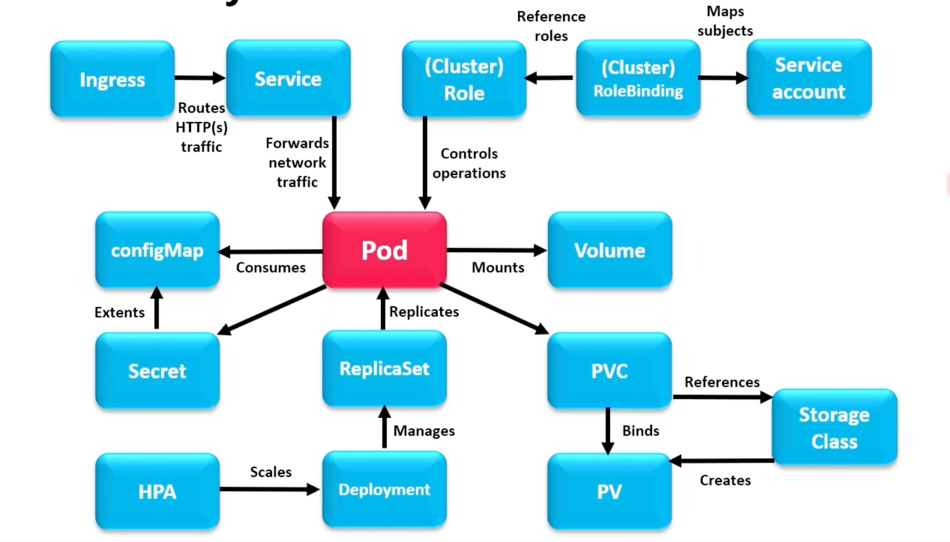
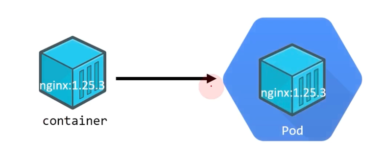
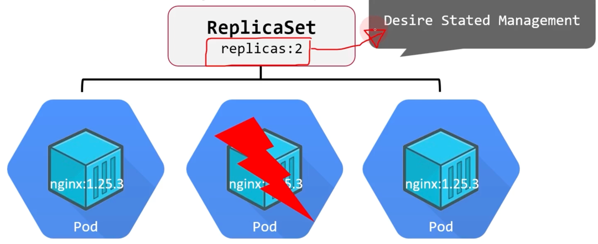
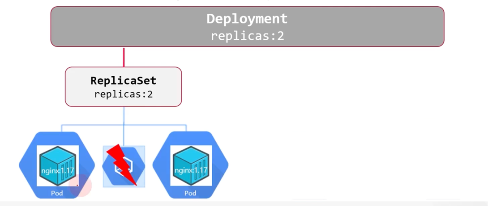
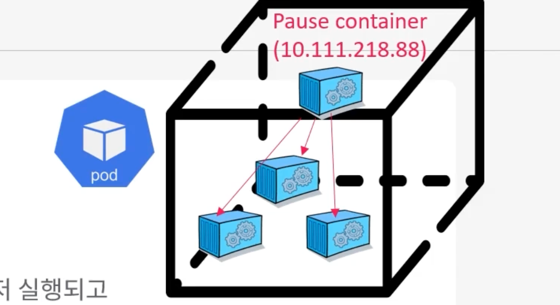
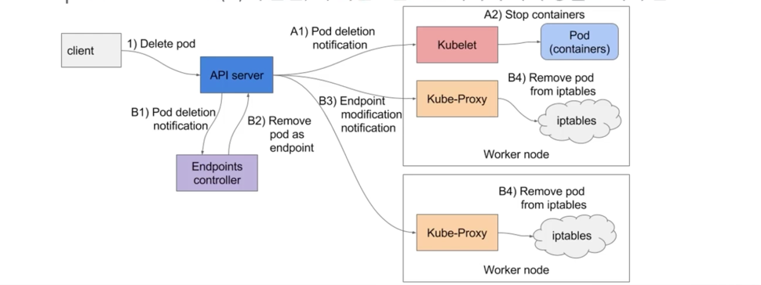
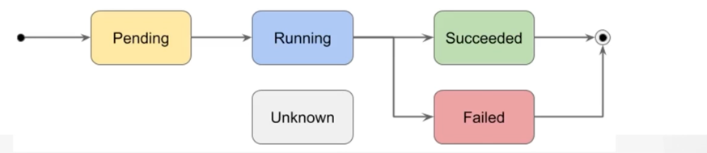

# Pod 생성과 관리

## Pod 관리 및 Lifecycle

### k8s API resource (or object)



* 각 기능 별로 사용자가 의도한 상태의 작업을 수행하는 object

```
$ kubectl api-resources
```

k8s API resource 정의

```
apiVersion: object의 k8s가 지원하는 API 버전
kind: 어떤 object를 생성할 것인지 종류 지정
metadata: object 설명을 위한 메타데이터 정의 (name, space, label, ..)
spec: object 정의(선언, 리스트가 아니므로 정의하는 하위 속성의 순서는 무관)
```

```
# myapp.yaml

apiVersion: apps/v1
kind: Deloyment
metadata:
  name: myapp-deployment
  labels:
    app: myapp
  namespace: myapp-ns
spec:
  replicas: 3
  selector:
    matchLabels:
      app:myapp
  template:
    metadata:
      labels:
      app: myapp
    spec:
      containers:
      - name: nginx-container
        image: nginx:1.14.2
        ports:
        - containerPort: 80
```

### k8s object relationship



* Pod 는 기본적으로 container 들을 담고 있는 k8s 최소 실행 단위



* ReplicaSet은 Desire state Management이며, Pod 가 죽더라도 설정한 replicas 수 만큼 유지를 시켜줌



* Deployment 는 ReplicaSet 관리 및 Rolling Update, Rollback, ReplicaSet 생성/교체를 통해 애플리케이션 배포를 선언적으로 관리

### Pod 가 포함하는 container 의 종류

* Runtime Container : 실제 애플리케이션을 수행
* Init Container : 기동 시점에 처리하고 종료됨
* Sidecar Container : 보조 역할로써 배포됨


### 왜 컨테이너가 아닌 Pod로 추상화 했을까?

* Pause Container(Pod 마다 생성됨)를 통해 HostOS 의 namespace(lsns, Linux kernel 기술)을 공유
* Pod 내부의 컨테이너들은 Pod 외부와 격리된 컨테이너의 장점을 유지하면서, Pod 내부에서는 자원(network, storage)를 공유하는 프로세스를 여러 개의 container로 실행할 수 있는 장점을 갖음
* IPC, Network, PID, File System 등이 namespace를 통해 공유
* Pod 내부의 프로세스들은 localhost에 접근하듯 서로에 접근할 수 있게 됨


Pause Container



* Pod는 실행될 때 pause 라는 이름의 container가 먼저 실행됨
* 이 pause container의 namespace를 Pod 내부의 모든 container들이 공유해서 사용
* SIGINT, SIGTERM 시그널을 받기 전까지 동작도 하지 않고 Pod 내에서 sleep 상태로 대기


## Pod 관리

### 선언형 Pod 생성

```
$ kubectl apply -f myweb1-pod.yaml
$ kubectl apply -f myweb1-svc.yaml
$ kubectl get po,svc -o wide | grep myweb
pod/myweb1                              1/1     Running   0             50s    10.111.156.66    k8s-node1   <none>           <none>
service/myweb1-svc                 ClusterIP   10.111.209.255   192.168.56.101   8001/TCP    16s     app=myweb1
```

### 선언형 Pod 삭제

```
$ kubectl delete -f myweb1-pod.yaml
$ kubectl delete -f myweb1-svc.yaml
```

### 명령형 Pod 생성

```
$ kubectl run myweb2 --image=nginx:1.15.3-alpine --port=80 --dry-run=client -o yaml > myweb2-pod.yaml
$ kubectl apply -f myweb2-pod.yaml
$ kubectl expose pod myweb2 --port=80 --name=myweb2-svc --port=8002 --target-port=80
```

### 명령형 Pod 삭제

```
$ kubectl delete pod myweb2
$ kubectl delete svc myweb2-svc
```

### Pod 삭제 과정



1. Pod 삭제 요청이 API 서버에 수신되면, 우선 etcd 상태를 수정
2. 요청을 수행하는 kubelet(A) 와 Endpoints Controller(B) 에 알림, 이 이벤트는 API 서버에 의해 병렬처리됨
3. Endpoints Controller는 제거할 Pod 가 사용중 인 IP 등의 정보를 회수
4. 각 노드의 Kube-Proxy 는 iptables 에서 해당 Pod 의 정보를 제거
5. API 서버는 노드의 kubelet에게 지시를 내려 pod에 SIGTERM 신호를 보냄
6. SIGTERM 을 받으면 처리 중이던 작업을 완료하고, 새로운 요청을 받지 않도록 개발됨
7. kubelet에서 pod에 SIGTERM을 보낸 후에 일정 시간 동안 graceful shutdown이 되지 않는다면 강제로 SIGKILL을 보내서 pod를 강제종료 시킴


### Pod 상태



* Pending : Pod의 작성을 기다리고 있는 상태, 컨테이너 image 다운로드 등에 소비되는 시간
* Running : Pod가 가동 중인 상태
* Succeeded : Pod 내의 컨테이너가 정상적으로 종료된 상태
* Failed : Pod 내의 컨테이너 중 특정 컨테이너가 실패하여 종료된 상태
* Unknown : 어떤 이유로 Pod와 통신이 불가능한 상태

### Pod Conditions

* Initialized : 모든 초기화 컨테이너가 성공적으로 시작 완료된 상태
* Ready : Pod는 요청이 가능한 상태
* ContainersReady : Pod 안 모든 컨테이너가 준비 상태
* PodScheduled : Pod가 하나의 Node로 스케줄을 완료한 상태
* Unschedulable : 스케줄러가 자원 부족, 여러 제약 등으로 바로 Pod 스케줄 할 수 없는 상태

