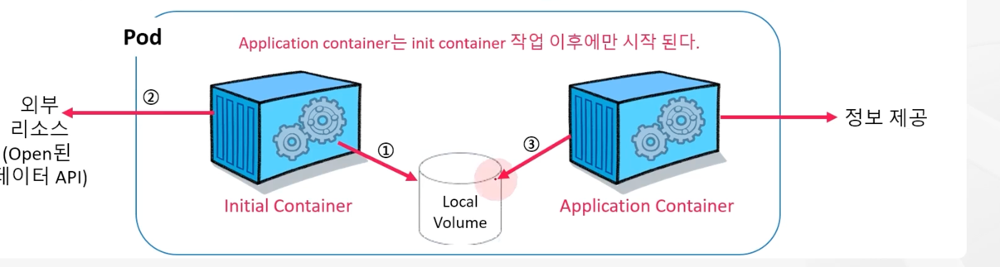
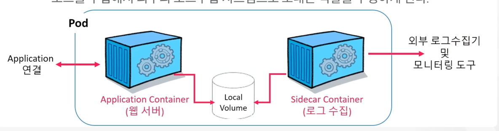

## Pod 설계 패턴

### Runtime container


* Pod가 포함하는 일반적인 애플리케이션 컨테이너를 runtime container 라고 한다.
* Pod는 애플리케이션 코드가 포함된 단일 컨테이너에 대한 wrapper(포장지) 역할
* Pod가 예기치 않게 종료되면 k8s는 이를 수정하지 않고 그 자리에 새 Pod를 생성하고 새로 시작된 Pod는 DNS 및 IP 주소를 제외한 기존 Pod의 복제본
* DNS 와 IP 가 바뀌더라도 Service 및 내부 통신에서는 컨테이너 이름 등으로 통신하기에 영향 없음

### Initial container

* 한 Pod에 있는 Application container 이전에 실행되는 특수 컨테이너
* initial container는 다양한 목적으로 사용될 수 있지만 모두 기본 프로세스인 application container 가 원하는 방향으로 실행될 수 있도록 준비하는데 있다.
* 어떤 방식으로든 메인 프로세스의 환경을 초기화를 수행
* Pod에 대한 모든 네트워킹 및 스토리지가 프로비저닝된 후에 실행
* initial container가 실패하면 kubelet은 성공할 때까지 해당 init 컨테이너를 반복적으로 재시작
* 단, Pod restartPolicy: Never 가 지정되었다면 전체 Pod를 실패한 것으로 처리 뒤 종료




### initial container 사례

1. Local volume 에 공유 영역 생성
2. initial container는 외부 리소스에 curl 요청을 보내고 해당 데이터를 local volume에 기록
3. Application container는 시작과 함께 동일한 local volume에서 필요한 데이터를 읽는다.

ex) initial container에서 날씨 API를 호출하여 local volume에 기록한 후 nginx 에서 해당 정보를 공유 받아 index.html 에 정보 제공

```
$ kubectl apply -f weather-pod.yaml


# Pod state 변화
$ kubectl get po -o wide | grep weather-pod
weather-pod                         0/1     Init:0/1   0            2s     10.111.156.71    k8s-node1   <none>           <none>

weather-pod                         0/1     PodInitializing   0            3s     10.111.156.71    k8s-node1   <none>           <none>

weather-pod                         1/1     Running   0            11s    10.111.156.71    k8s-node1   <none>           <none>


$ curl  10.111.156.71
{"latitude":37.55,"longitude":127.0625,"generationtime_ms":0.08940696716308594,"utc_offset_seconds":0,"timezone":"GMT","timezone_abbreviation":"GMT","elevation":22.0,"current_weather_units":{"time":"iso8601","interval":"seconds","temperature":"°C","windspeed":"km/h","winddirection":"°","is_day":"","weathercode":"wmo code"},"current_weather":{"time":"2026-02-09T05:45","interval":900,"temperature":1.4,"windspeed":7.3,"winddirection":261,"is_day":1,"weathercode":0}}
```

## Sidecar container

* sidecar container는 application container와 함께 작동하여 특정 추가 기능과 애플리케이션의 관찰 가능성 향상을 위해 로깅 및 모니터링 서비스를 구현할 수 있다.
* sidecar container를 활용하면 코드 분리를 촉진하고 관찰 가능성을 개선하며, 확장성과 보안을 단순화하여 k8s 배포를 향상할 수 있다.
* application container 에는 원래 목적의 기능에만 충실하고 나머지 부가적인 공통 기능들은 sidecar container를 추가해서 사용할 수 있다.



* 일반적인 웹서버의 예를 생각해보면 웹서버 컨테이너는 웹서버로서의 역할에 충실하고, 자신의 로그는 Pod의 파일로 남길 수 있다.
* 그러면 Sidecar container 역할인 로그 수집 컨테이너가 파일 시스템에 쌓이는 로그를 수집해서 외부의 로그 수집 시스템으로 보내는 역할을 수행하게 된다.

ex) sidecar container를 통해 수집된 로그(1초씩 date 실행)를 nginx container 의 index.html에 적용

```
$ kubectl apply -f log-pod.yaml

$ curl 10.111.156.74
Sun Feb  8 20:08:36 UTC 2026
Sun Feb  8 20:08:37 UTC 2026
Sun Feb  8 20:08:38 UTC 2026
Sun Feb  8 20:08:39 UTC 2026
Sun Feb  8 20:08:40 UTC 2026
Sun Feb  8 20:08:41 UTC 2026
...
```