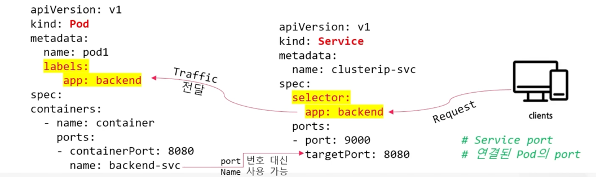
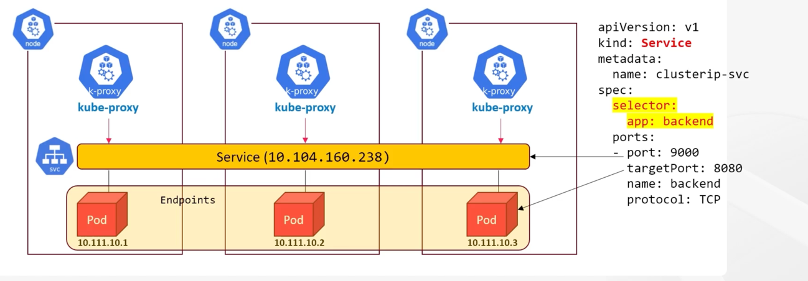
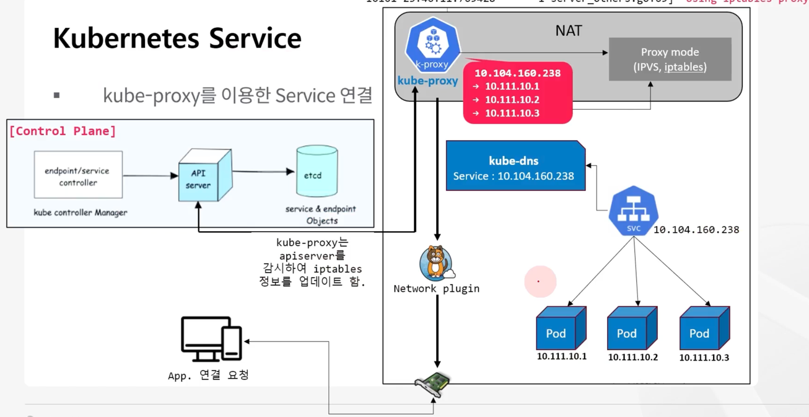
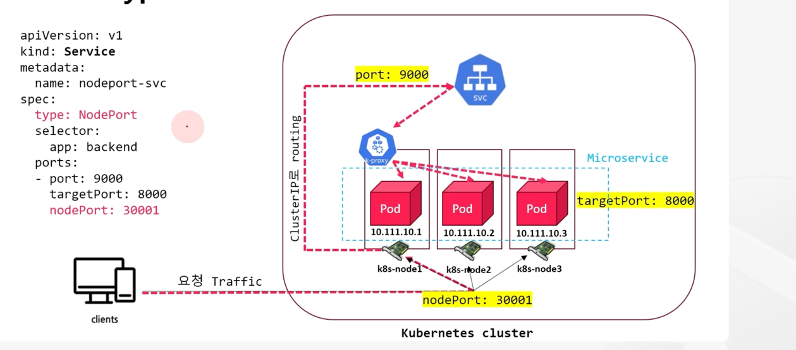
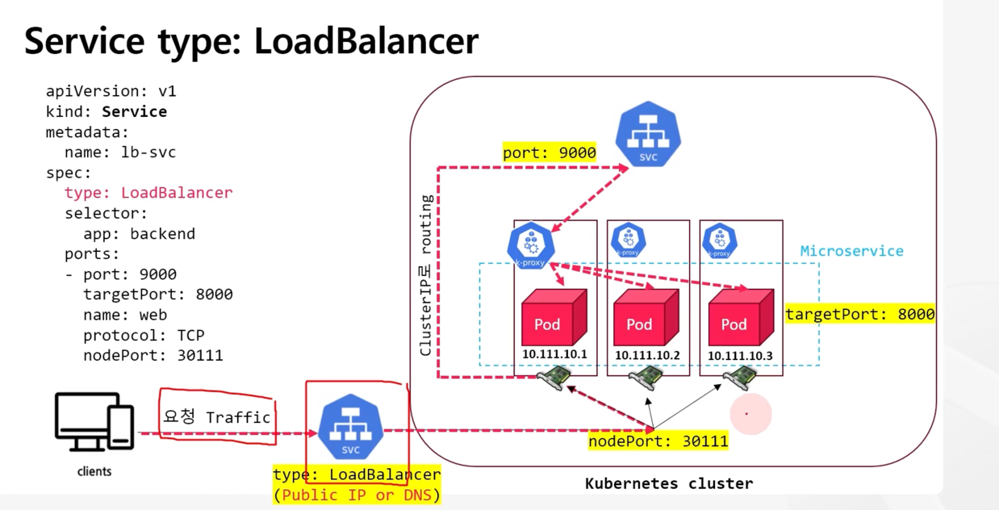
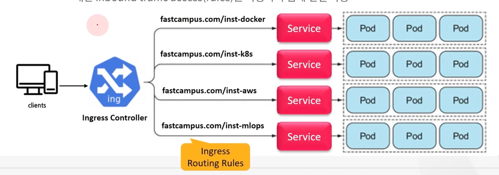

# Pod 네트워킹을 위한 Service 생성과 관리

## Service object가 필요한 이유

### k8s Service

* Service는 네트워크 추상화 object로, 생성된 Pod에 동적 접근이 가능하고, 이를 통해 애플리케이션을 클러스터 내의 네트워크 서비스로 노출할 수 있다.
* Service는 IP 주소 또는 DNS 이름을 통해 특정 포트에 직접 액세스할 수 있도록 Pod를 논리적으로 그룹화할 수 있다.
* k8s는 Pod에게 고유한 IP 주소를 할당하고, Service를 생성하여 Pod 집합에 대한 단일 DNS 명을 부여하여 부하 분산을 수행할 수 있다.


### Service는 왜 필요할까



* Pod에 문제가 생기면 k8s 는 그 Pod를 삭제 후 재생성한다.
* 이 때 기존 Pod IP가 같을 확률은 매우 낮다.
* k8s 설계 사상은 Pod는 언제든 장애에 의해서 Down 될 수 있고, 신규 Pod는 새로운 IP가 부여되기 때문에 애플리케이션을 매번 수정을 해야 하는 불편함이 있는데, 
이를 없애기 위해 Service를 연결하여 사용하게 되었다.
* 클러스터의 외부에서 내부의 Pod 애플리케이션 접근을 위한 단일 진입점 역할을 한다.
* Proxy(Load Balancer)의 역할처럼 연결된 Pod 들에 트래픽을 전달하는 object 가 필요
* Service object는 연결된 각각의 Pod로 Client 요청 트래픽을 포워딩 해주는 Proxy와 같다.


### Service는 어떻게 연결되나?



* Service는 가상 IP 와 port를 갖고 생성
* kube-proxy는 이 Service의 가상 IP를 구현하고 port와 함께 관리하는 역할
* Service object는 Pod를 트래픽에 노출, Endpoint object에는 Pod IP 주소와 port 포함
* Service를 사용하여 Pod를 노출하면 kube-proxy는 Service object와 그룹화된 Pod로 트래픽을 보내는 네트워크 규칙(Rules) 생성
* kube-proxy는 Service 변경 사항 및 Endpoint 모니터링 후 설정된 mode(iptables, IPVS)를 사용하여 Service에 연결된 Pod로 트래픽을 routing 하기 위한 rule 생성, 업데이트




## Service type

* ClusterIP : Service를 클러스터 내부 가상 IP를 구현하여 노출
* NodePort : 고정 포트(30000 ~ 32767)로 각 Node의 IP에 Service를 외부에 노출
* LoadBalancer : 클라우드 공급자(CSP)의 로드 밸런서를 사용하여 Service를 외부에 노출
* ExternalName : 일반적인 selector 연결이 아닌 외부 서비스에 대한 DNS name을 제공해 내부 파드가 외부의 특정 도메인에 접근하기 위한 리소스


* Ingress : Ingress를 사용하여 Service를 외부에 노출, Ingress는 서비스 유형은 아니지만, 클러스터의 진입점 역할을 수행


### ClusterIP

* ClusterIP 서비스는 외부에 노출될 필요가 없는 애플리케이션의 내부 통신을 위한 타입
* 예를들어, backend 서비스에서 DB 서비스로 데이터 요청 처리를 하는 내부 연결 애플리케이션인 경우 ClusterIP 서비스를 사용하여 연결
* 서비스 type 의 default type

```
apiVersion: v1
kind: Service
metadata:
  name: clusterip-svc
spec:
  selector:
    app: backend
  ports:
    - protocol : TCP
      port: 9000
      targetPort: 8000
  type: ClusterIP
```

### NodePort



* NodePort는 애플리케이션에 대한 외부 연결을 활성화하여 ClusterIP 서비스의 기능을 확장
* NodePort 서비스를 생성하면 클러스터의 모든 Node에 특정한 포트(30000 ~ 32767)를 열어 외부에서 접근, 생성된 Service의 ClusterIP로 트래픽 routing
* 이 때 kube-proxy(Service -> Pod)가 이를 forwarding 하도록 netfilter의 chain rule 수정
* 웹 애플리케이션이나 API와 같이 클러스터 외부에서 액세스해야 하는 애플리케이션에 적합
* 외부에서 <NodeIP>:<NodePort>로도 접근 가능
* Cluster 내부에서 <내부IP>:<port> 접속 가능

```
apiVersion: v1
kind: Service
metadata:
  name: nodeport-svc
spec:
  selector:
    app: backend
  ports:
    - protocol : TCP
      port: 9000
      targetPort: 8000
      nodePort: 30001 # 지정안하면 랜덤
  type: NodePort
```

externalTrafficPolicy : { Local | Cluster }
* Local 정책으로 변경하면, 외부 요청에 대해 Cluster 정책처럼 무작위 트래픽 분산이 되지 않고, 처음 들어온 node의 pod로만 지속적으로 연결됨
  (kube-proxy는 proxy 요청을 Local endpoint 로만 proxy하고 트래픽을 다른 node로 전달 안함)


internalTrafficPolicy : { Local | Cluster }
* 내부 요청에 대해 Service에 그룹화된 Pod 중 동일 Node에 존재하는 Pod 간의 트래픽 정책


sessionAffinity : ClientIP 로 주면, 같은 클라이언트 IP는 같은 Pod로 감

```
...
spec:
  clusterIP: 10.96.100.100
  clusterIPs:
  - 10.96.100.100
  externalTrafficPolicy: cluster
  internalTrafficPolicy: cluster
...
```


## LoadBalancer



* 클라우드 서비스 공급자(CSP - AWS, GCP) 에서 제공하는 외부 Load Balancer 를 이용해 클러스터 외부에서 접근 가능하도록 노출하는 서비스로
Node 앞에 위치해 각 Node들로 트래픽을 분산하는 역할
* LoadBalancer 서비스는 NodePort 서비스 위에 적용, L4 LoadBalancer 가 생성되고, ClusterIP 서비스 및 NodePort 서비스가 암시적으로 생성됨
* Public 으로 사용 가능한 IP 주소 및 DNS 주소를 제공하여 Private IP 주소 및 NodePort 포트를 통해 클러스터의 Node에 트래픽을 Load Balancing 하고 전달
* LoadBalancer 서비스는 웹 애플리케이션이나 API와 같이 높은 트래픽 양을 처리해야 하는 애플리케이션에 유용
* 클라우드 환경이 아닌 온프레미스(VM) 환경에서 LoadBalancer를 사용할 경우 제공한 public 주소를 제공할 수 있는 MetalLB(bare metal load balancer) 모듈을 설치해줘야 함


### MetalLB

* 온프레미스 클러스터에서는 AWS, GCP 와 같이 Load Balancer 를 제공하지 않으므로 부하 분산 기능 및 외부 연결용 IP 주소를 제공하는 리소스가 필요
* MetalLB는 Bare Metal 환경(가상화 하지 않고 사용하는 고성능 물리 서버)에서 사용할 수 있는 Load Balancer 기능을 제공하는 CNCF의 오픈소스 프로젝트
* MetalLB는 네트워크 로드 밸런서를 제공, "외부 IP 주소 풀"을 사용하여 온프레미스 및 VM 등의 가상 환경 클러스터에서 외부 서비스에 접근 가능
* MetalLB 목적은 LoadBalancer IP 로 전달되는 트래픽을 클러스터 Node로 유도
* 트래픽이 Node에 도달하면 MetalLB의 역할은 끝나고, 그 다음은 클러스터의 CNI에서 처리
* Layer2 of BGP 모드가 있음


## Ingress

* Ingress object는 클러스터 외부에 있는 HTTP 및 HTTPS 경로를 서비스에 노출하고 트래픽 규칙을 정의
* Ingress object는 일반적으로 로드 밸런서를 통해 수신 규칙 및 요청을 이행하는 Ingress Controller를 사용
Nginx Controller, Envoy Controller, AWS Load Balancer Controller 등
* Ingress object를 사용하면 사용하는 로드밸런서의 수를 줄일 수 있다.
* Ingress object 및 Controller 를 사용하면 기존의 서비스 당 로드 밸런서 하나에서 Ingress 당 로드 밸런서 하나로 전환하고 여러 서비스로 라우팅할 수 있다.
* 트래픽은 경로 기반 라우팅을 사용하여 적절한 서비스로 라우팅 가능
* Ingress는 실제로 서비스 유형이 아닌 여러 서비스 앞에 있으며 "스마트 라우터" -> 즉, 클러스터의 진입점 역할


k8s 내부 처리 과정



* Internet(external traffic) -> Ingress(routing rule) -> one more Service -> one more web APP pods -> container

```
apiVersion: networking.k8s.io/v1
kind: Ingress
metadata:
  name: minimal-ingress
  annotations:
    ingress.kubernetes.io/rewrite-target: /
spec:
  ingressClassName: nginx
  rules:
  - http:
      paths:
      - path: /testpath
        pathType: Prefix
        backend:
          service:
            name: test
            port:
              number: 80
```

nginx ingress controller 설치

```
$ kubectl apply -f https://raw.githubusercontent.com/kubernetes/ingress-nginx/controller-v1.8.2/deploy/static/provider/baremetal/deploy.yaml
```


