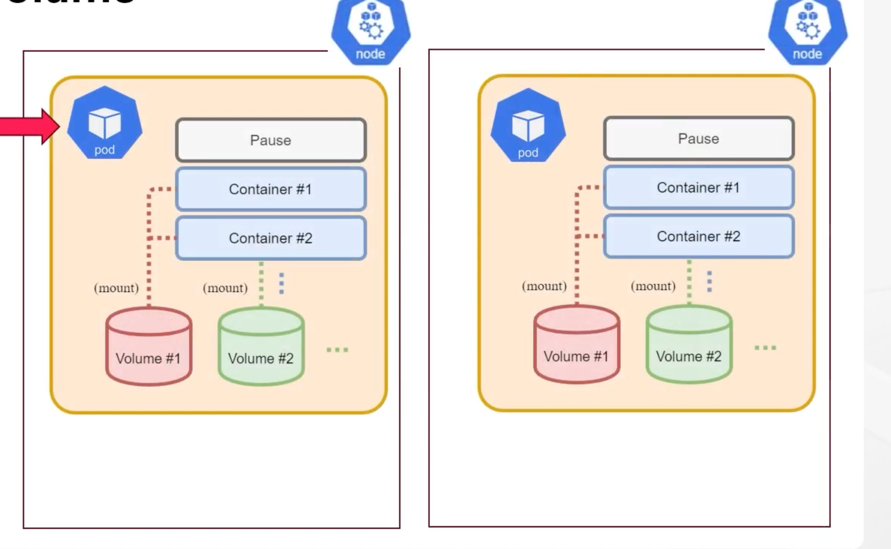

# Pod Volume mount 생성

## k8s Volume 이해

* k8s는 Storage Volume 정의를 통해 Pod의 Volume을 정의한다.
* Pod 컨테이너 내에 저장된 파일은 별도 설정이 없으면, Host의 임시 디스크에 보관
* Pod 삭제 및 재시작 시 임시 디스크의 데이터도 함께 손실 됨
* 멀티 컨테이너 Pod는 내부 컨테이너 간 데이터 공유 수행이 필요


* Volume 은 Podspec 에 포함하여, Pod 내 filesystem에 mount 됨
* Podspec -> .spec.volumes 구문으로 볼륨 기술 및 이름 지정
* .spec.containers[*].volumeMounts 컨테이너 내부 filesystem에 mount
* Volume은 데이터 공유 및 지속성에 도움 되고, 일부 API 기능을 통해 데이터 이전 효과도 지원

```
...
spec:
  containers:
  - name: contaienr1
    image: debian
    volumeMounts:
    - mountPath: internal-volume
      name:mountPath: /mount1
  - name: container2
    image: debian
    volumeMounts:
    - name: internal-volume
      mountPath: /mount2
      readOny: true
  volumes:
  - name: internal-volume
    emptyDir: {}
```




## Volume 방식


### emptyDir

* Pod 생성 시 Podspec에 의해 Pod 내부에 존재하는 Volume 생성
* 임시 데이터를 저장하는데 사용되는 비어 있는 디렉터리 제공 방식
* 동일 Pod 내의 모든 컨테이너의 접근이 가능하고 내부 데이터 공유를 위해 사용
* Pod와 lifecycle이 같다.
* HDD, SDD, Network Storage 등의 디스크 혹은 메모리 사용 가능

ex) multi container Pod에 emptyDir 활용


```
$ kubectl apply -f temp-pod1.yaml
```

```
$ kubectl exec -it temp-pod1 -c temp-container1 -- bash
$ df -h
Filesystem      Size  Used Avail Use% Mounted on
...
/dev/sda2        97G   20G   73G  21% /mount1

$ cd /mount1/ && echo 'hello' > test.txt

$ kubectl exec -it temp-pod1 -c temp-container2 -- bash
$ cd /mount2
$ ls test.txt
test.txt
```

### hostPath

* hostPath는 영구 볼륨으로 Pod가 생성된 Node 파일시스템의 File 및 Directory에 Volume으로 mount
* 데이터가 특정 Node에 저장되므로 Pod가 재생성되어 Node가 바뀌면 이전 Node에 저장되어 있던 hostPath Volume 의 데이터를 읽지 못함
* Node 내 저장된 파일을 Pod 들 간 공유해야 하는 경우에 사용되지만, 단일 노드에만 생성되므로 테스트 상황에 적합
* Pod가 삭제되어도 내용이 삭제되지 않는다.
* HostPath 볼륨에는 많은 보안 위험이 있으며, 가능하면 HostPath를 사용하지 않는 것이 좋으며, 사용해야 하는 경우는 필요한 파일, 디렉토리로 범위를 지정하고 readOnly로 마운트 해야한다.

```
apiVersion: v1
kind: Pod
metadata:
  name: host-pod1
spec:
  containers:
  - name: container
    image: nginx:1.14.2
    volumeMounts:
    - name: host-path
      mountPath: /mount1
  volumes:
  - name: host-path
    hostPath:
      path: /DATA1/test
      type: DirectoryOrCreate
```


### NFS(Network File System)

* NFS 를 사용하면 해당 파일 시스템을 공유하기 때문에 Pod가 재생성되어 Node 가 바뀌어도 데이터를 읽을 수 있다.

NFS 구성

```
# 모든 노드 실행
$ sudo apt -y install nfs-kernel-server
$ systemctl enable --now nfs-kernel-server
$ systemctl restart nfs-server
$ systemctl status nfs-server
```

```
# 1번 노드에서 실행
$sudo vi /etc/exports
/DATA1/test *(rw,sync,no_root_squash,no_subtree_check,insecure)

$ sudo systemctl restart nfs-server
```

```
# 다른 노드에서 실행
$ sudo mount -t nfs k8s-node1:/DATA1/test /DATA1/test 
```

```
apiVersion: v1
kind: Pod
metadata:
  name: nfs-pod1
spec:
  containers:
  - name: container
    image: nginx:1.14.2
    volumeMounts:
    - name: nfs-vol
      mountPath: /mount1
  volumes:
  - name: nfs-vol
    nfs:
      path: /DATA1
      server: 192.168.56.101
```

## PV, PVC

* hostPath 방식은 리소스 관리 및 보안 측면에서 권장하지 않는다.
* k8s는 PV object로 Storage를 추상화하고 PVC object 로 Storage를 할당 받아 사용할 수 있게 구현
* PV(Persistent Volume)은 관리자나 StorageClass에 의해 생성되는 Volume
* PVC(Persistent Volume Claim) 은 사용자가 Volume 을 사용하기 위해 PV에 요청
* PV는 스토리지 그 자체이고, PVC 는 사용자, 개발자가 PV에게 Volume 할당을 요청하는 것
* 용량(capacity)와 권한(accessModes) 설정을 통해 요청


### PV, PVC LifeCycle


* Provisioning : PV를 만드는 단계, 이 단계에서는 PV를 미리 만들고 사용하는 정적 방법과 요청이 있을 때 PV를 만드는 동적 방법이 있다.
* Binding : 생성한 PV를 PVC와 연결하는 단계, PV와 PVC는 1:1 관계에 있다.
* Using : PVC는 Pod에서 사용되고, Pod는 PVC를 볼륨으로 인식하여 사용하는 관계
* Reclaiming : 사용이 끝난 PVC가 초기화 되는 단계
> Retain : PVC가 삭제될 때 대응되는 PV 상태는 bound -> Released로 바뀌며 다른 PVC가 연결될 수 없는 상태이며 PV 속 데이터는 유지 
> 
> Delete : PVC가 삭제될 때 대응되는 PV도 같이 삭제
> 
> Recycle : PVC가 삭제될 때 대응되는 PV 상태는 bound -> Pending으로 변경, 다른 PVC 대기


### AccessModes

* ROX(ReadOnlyMany) : 읽기만 가능, 모든 노드에서 접근 가능함
* RWX(ReadWriteMany) : 읽기-쓰기 가능, 모든 노드에서 접근 가능함
* RWO(ReadWriteOnce) : 단일 노드에서 읽기-쓰기로 마운트 가능함

### 예제

PV 생성(Provisioning)

```
apiVersion: v1
kind: PersistentVolume
metadata:
  name: pv1
spec:
  capacity:
    storage: 1G
  accessModes:
    - ReadWriteOnce
  local:
    path: /DATA1/test
  nodeAffinity:
    required:
      nodeSelectorTerms:
      - matchExpressions:
        - key: kubernetes.io/hostname
          operator: In
          values:
          - k8s-node1
```

PVC 생성 (Binding)

```
apiVersion: v1
kind: PersistentVolumeClaim
metadata:
  name: pvc1
spec:
  accessModes:
    - ReadWriteOnce
  resources:
    requests:
      storage: 1G
```

Pod (Using)

```
apiVersion: v1
kind: Pod
metadata:
  name: pvc-pod1
spec:
  containers:
  - name: container
    image: nginx:1.14.2
    volumeMounts:
    - name: mynode-path
      mountPath: /mynode
  volumes:
  - name: mynode-path
    persistentVolumeClaim:
      claimName: pvc1
```

### PV, PVC 가 보안적으로 나은 이유

* 노드 파일시스템 직접 접근 안 함(노드 OS 디렉토리 노출 안됨, kubelet 접근 불가)
* 권한 제어 가능(StorageClass로 제한, ReadOnly 설정 가능)
* 멀티 테넌시 격리(hostPath는 같은 노드에 있으면 경로만 알면 접근 가능하지만, PV는 Claim 단위로 바인딩돼서 다른 Pod가 마음대로 접근 못함)
* 근데, 사실 PV가 hostPath 기반이면 문제가 되기에 될 수 있기에, 외부 스토리지 기반 PV 사용 권장


## StorageClass

* 스토리지 동적 프로비저닝은 PVC 요청에 대한 PV 생성을 자동화
* 관리자는 PV 생성하기 위한 템플릿인 StorageClass 를 정의
* 각 StorageClass는 PV를 생성하는 책임이 있는 프로비저너를 지정
* 사용자가 특정 StorageClass를 참조하는 PVC를 생성하면 프로비저너는 PVC의 요구 사항과 일치하는 PV를 자동으로 생성하여 관리자의 수동 개입을 보류시킨다. (Pod 생성될 때, PV 생성됨)
* 프로비저너는 일반적으로 CSP가 제공하는 볼륨 플러그인을 사용 ex : kubernetes.io/gce-pd


### openebs driver를 이용한 StorageClass 생성

```
$ create ns openebs
$ kubectl apply -f https://openebs.github.io/charts/openebs-operator-lite.yaml
$ kubectl apply -f https://openebs.github.io/charts/openebs-lite-sc.yaml
```

```
apiVersion: v1
kind: PersistentVolumeClaim
metadata:
  name: openebs-pvc1
spec:
  accessModes:
    - ReadWriteOnce
  resources:
    requests:
      storage: 1Gi
  storageClassName: "openebs-hostpath"
```


