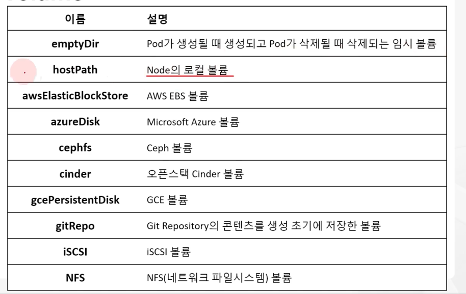
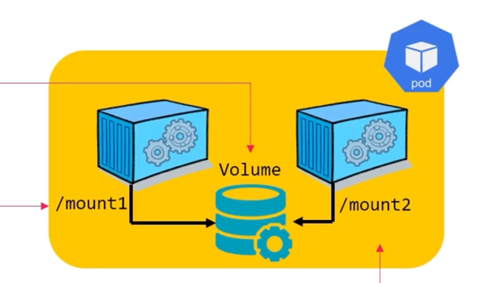

# Pod Volume mount 생성

## k8s Volume 이해

* k8s는 Storage Volume 정의를 통해 Pod의 Volume을 정의한다.
* Pod 컨테이너 내에 저장된 파일은 별도 설정이 없으면, Host의 임시 디스크에 보관
* Pod 삭제 및 재시작 시 임시 디스크의 데이터도 함께 손실 됨
* 멀티 컨테이너 Pod는 내부 컨테이너 간 데이터 공유 수행이 필요


* Volume 은 Podspec 에 포함하여, Pod 내 filesystem에 mount 됨
* Podspec -> .spec.volumes 구문으로 볼륨 기술 및 이름 지정
* .spec.containers[*].volumeMounts 컨테이너 내부 filesystem에 mount
* Volume은 데이터 공유 및 지속성에 도움 되고, 일부 API 기능을 통해 데이터 이전 효과도 지원

```
...
spec:
  containers:
  - name: contaienr1
    image: debian
    volumeMounts:
    - mountPath: internal-volume
      name:mountPath: /mount1
  - name: container2
    image: debian
    volumeMounts:
    - name: internal-volume
      mountPath: /mount2
      readOny: true
  volumes:
  - name: internal-volume
    emptyDir: {}
```


## Volume 방식




### emptyDir

* Pod 생성 시 Podspec에 의해 Pod 내부에 존재하는 Volume 생성
* 임시 데이터를 저장하는데 사용되는 비어 있는 디렉터리 제공 방식
* 동일 Pod 내의 모든 컨테이너의 접근이 가능하고 내부 데이터 공유를 위해 사용
* Pod와 lifecycle이 같다.
* HDD, SDD, Network Storage 등의 디스크 혹은 메모리 사용 가능

ex) multi container Pod에 emptyDir 활용



```
$ kubectl apply -f temp-pod1.yaml
```

```
$ kubectl exec -it temp-pod1 -c temp-container1 -- bash
$ df -h
Filesystem      Size  Used Avail Use% Mounted on
...
/dev/sda2        97G   20G   73G  21% /mount1

$ cd /mount1/ && echo 'hello' > test.txt

$ kubectl exec -it temp-pod1 -c temp-container2 -- bash
$ cd /mount2
$ ls test.txt
test.txt
```

### hostPath

