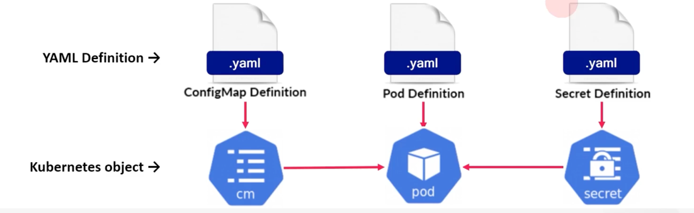
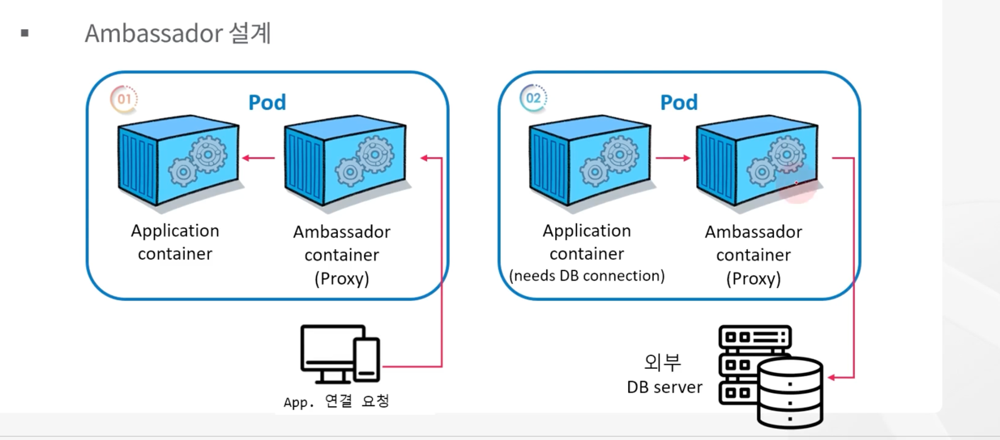

# Pod 환경 구성을 위한 object


## configMap & Secret 이해

* k8s는 Pod 생성에 사용되는 yaml 파일과 설정 값을 분리할 수 있는 ConfigMap, Secret 제공
* 주로 ConfigMap은 설정 값을 Secret은 노출 되서는 안되는 값을 넣어 줄 때 사용



* 개발, 테스트, 운영 환경에 사용되는 각기 다른 환경 값의 분리 필요
* 애플리케이션 Image는 동일하게 사용하고 필요한 환경 구성 값을 ConfigMap으로 만들거나
기밀이 요구되는(민감한) 데이터는 Secret으로 생성해 Pod에 적용해서 사용

```
$ kubectl create configmap api-key --from-literal API_KEY=pass1234!@#$
```

```
# configMap 에 있는 값들이 환경변수(env)로 설정됨
apiVersion: v1
kind: Pod
metadata:
  name: cm-pod
spec:
  containers:
  - image: nginx:1.14.2
    name: cm-container
    envFrom:
    - configMapRef:
        name: api-key
```


## ConfigMap

* configMap 은 key-value 쌍으로 기밀이 아닌 일반적인 데이터를 저장하는데 사용
* 주로 Pod 내 컨테이너가 사용할 구성(환경변수, 커맨드-라인 인수, 구성파일 등) 을 저장
* configMap 에 데이터 저장은 1MB 이하로 가능
* 개발과 운영에 서로 다른 설정을 적용하기 위해 사용

```
apiVersion: v1
kind: ConfigMap
metadata:
  name: my-confingmap
data:
  string-value : "hello world"
  number-value : "123456789"
  list-value : |
  - item1
  - item2
  object-value : |
    foo: bar
    baz: qux
  json-value : |-
    {
      "foo": "bar" 
    }
```

## Ambassador Pod design Pattern

* Ambassador는 Pod 내에 Proxy 역할을 하는 컨테이너를 추가하는 패턴
* Pod 내에서 외부 서버에 접근하거나 외부에서 Pod 애플리케이션에 접근할 때, 
Pod 내부의 Ambassador 컨테이너에 접근하도록 하고, 살제 외부와의 연결은 Proxy 에서 처리하는 방식
* 외부 서비스에 균일한 인터페이스를 제공하여 외부 서비스를 더 쉽게 관리하고 확장하는데 사용
* Ambassador 컨테이너는 기본 애플리케이션 컨테이너를 대신하여 네트워킹, 인증, 로깅, 모니터링과 같은 특정 교차문제를 처리하는 일에 적합



외부의 요청을 ambassador 가 받아 애플리케이션으로 proxy 하는 예제

```
$ vi nginx.conf
event {
  worker_connections  1024;
}
http {
  upstream backend {
     server backend:8080;
   }
   
  server {
    listen       80;
    location / {
      proxy_pass http://backend;
      proxy_redirect off;
    }
  }
}

$ kubectl create configmap nginx-conf --from-file=nginx.conf
```

```
apiVersion: v1
kind: Pod
metadata:
  name: app-pod
  labels:
    app: app
spec:
  containers:
  - name: proxy-container
    image: nginx:1.14.2
    ports:
    - containerPort: 80
      protocol: TCP
    volumeMounts:
    - name: nginx-config
      mountPath: /etc/nginx
  ...
  volumes:
  - name: nginx-config
    configMap:
      name: nginx-conf
```


## Secret

* Secret 은 일반적으로 비밀번호, Oauth 토큰, API 키, TLS 인증서, ssh 키와 같은 민감한 credential이 요구되는 데이터를 base64로 인코딩하여 저장, 관리 한다.
* 사용방법은 ConfigMap과 유사
* Pod에 Secret 적용 시 자동 decoding 되어 애플리케이션에서 바로 사용 가능

```
$ kubectl create secret generic api-key --from-literal API_KEY=pass1234!@#$
```

```
# secret 에 있는 값들이 환경변수(env)로 설정됨
apiVersion: v1
kind: Pod
metadata:
  name: sc-pod
spec:
  containers:
  - image: nginx:1.14.2
    name: sc-container
    envFrom:
    - secretRef:
        name: api-key
```

