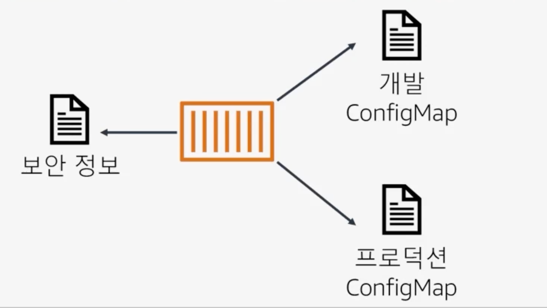
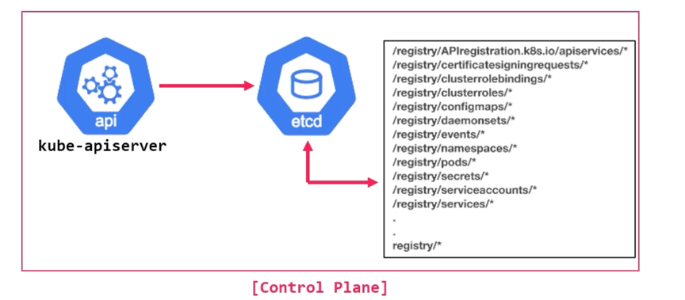

# Pod 환경 구성을 위한 object




## configMap & Secret 이해

* k8s는 Pod 생성에 사용되는 yaml 파일과 설정 값을 분리할 수 있는 ConfigMap, Secret 제공
* 주로 ConfigMap은 설정 값을 Secret은 노출 되서는 안되는 값을 넣어 줄 때 사용


* 개발, 테스트, 운영 환경에 사용되는 각기 다른 환경 값의 분리 필요
* 애플리케이션 Image는 동일하게 사용하고 필요한 환경 구성 값을 ConfigMap으로 만들거나
기밀이 요구되는(민감한) 데이터는 Secret으로 생성해 Pod에 적용해서 사용

```
$ kubectl create configmap api-key --from-literal API_KEY=pass1234!@#$
```

```
# configMap 에 있는 값들이 환경변수(env)로 설정됨
apiVersion: v1
kind: Pod
metadata:
  name: cm-pod
spec:
  containers:
  - image: nginx:1.14.2
    name: cm-container
    envFrom:
    - configMapRef:
        name: api-key
```


## ConfigMap

* configMap 은 key-value 쌍으로 기밀이 아닌 일반적인 데이터를 저장하는데 사용
* 주로 Pod 내 컨테이너가 사용할 구성(환경변수, 커맨드-라인 인수, 구성파일 등) 을 저장
* configMap 에 데이터 저장은 1MB 이하로 가능
* 개발과 운영에 서로 다른 설정을 적용하기 위해 사용

```
apiVersion: v1
kind: ConfigMap
metadata:
  name: my-confingmap
data:
  string-value : "hello world"
  number-value : "123456789"
  list-value : |
  - item1
  - item2
  object-value : |
    foo: bar
    baz: qux
  json-value : |-
    {
      "foo": "bar" 
    }
```

## Ambassador Pod design Pattern

* Ambassador는 Pod 내에 Proxy 역할을 하는 컨테이너를 추가하는 패턴
* Pod 내에서 외부 서버에 접근하거나 외부에서 Pod 애플리케이션에 접근할 때, 
Pod 내부의 Ambassador 컨테이너에 접근하도록 하고, 살제 외부와의 연결은 Proxy 에서 처리하는 방식
* 외부 서비스에 균일한 인터페이스를 제공하여 외부 서비스를 더 쉽게 관리하고 확장하는데 사용
* Ambassador 컨테이너는 기본 애플리케이션 컨테이너를 대신하여 네트워킹, 인증, 로깅, 모니터링과 같은 특정 교차문제를 처리하는 일에 적합


외부의 요청을 ambassador 가 받아 애플리케이션으로 proxy 하는 예제

```
$ vi nginx.conf
event {
  worker_connections  1024;
}
http {
  upstream backend {
     server backend:8080;
   }
   
  server {
    listen       80;
    location / {
      proxy_pass http://backend;
      proxy_redirect off;
    }
  }
}

$ kubectl create configmap nginx-conf --from-file=nginx.conf
```

```
apiVersion: v1
kind: Pod
metadata:
  name: app-pod
  labels:
    app: app
spec:
  containers:
  - name: proxy-container
    image: nginx:1.14.2
    ports:
    - containerPort: 80
      protocol: TCP
    volumeMounts:
    - name: nginx-config
      mountPath: /etc/nginx
  ...
  volumes:
  - name: nginx-config
    configMap:
      name: nginx-conf
```


## Secret

* Secret 은 일반적으로 비밀번호, Oauth 토큰, API 키, TLS 인증서, ssh 키와 같은 민감한 credential이 요구되는 데이터를 base64로 인코딩하여 저장, 관리 한다.
* 사용방법은 ConfigMap과 유사
* Pod에 Secret 적용 시 자동 decoding 되어 애플리케이션에서 바로 사용 가능

```
$ kubectl create secret generic api-key --from-literal API_KEY=pass1234!@#$
```

```
# secret 에 있는 값들이 환경변수(env)로 설정됨
apiVersion: v1
kind: Pod
metadata:
  name: sc-pod
spec:
  containers:
  - image: nginx:1.14.2
    name: sc-container
    envFrom:
    - secretRef:
        name: api-key
```

## Secret의 고급활용

### openssl 활용, https 를 위한 secret

```
$ mkdir secret_https && cd $_
$ mkdir -p ./secret/cert
$ mkdir -p ./secret/key
$ mkdir -p ./secret/kubetmp
$ cd ./secret/cert
$ openssl genrsa -out https.key 2048
$ openssl req -new -x509 -key https.key -out https.crt -days 360 -subj /CN=*.k8s.io


$ kubectl create secret generic k8s-https --from-file=https.key --from-file=https.crt
$ kubectl get secret k8s-https -o yaml
$ kubectl get secret k8s-https
NAME        TYPE     DATA   AGE
k8s-https   Opaque   2      41s
```

```
$ mkdir config & cd $_
$ vi nginx.conf
server {
  listen 443 ssl;
  server_name *.k8s.io;
  ssl_certificate certs/https.crt;
  ssl_certificate_key certs/https.key;
  location / {
    root /usr/share/nginx/html;
    index index.html index.htm;
  }
}

$ kubectl create configmap nginx-conf --from-file=config/nginx.conf
$ kubectl get cm nginx-conf
NAME         DATA   AGE
nginx-conf   1      41s
```

```
$ vi nginx-pod.yaml
apiVersion: v1
kind: Pod
metadata:
  name: https-nginx-pod
spec:
  containers:
  - name: nginx-container
    image: nginx:1.14.2
    volumeMounts:
    - name: config
      mountPath: /etc/nginx/conf.d
      readOnly: true
    - name: certs
      mountPath: /etc/nginx/certs
      readOnly: true
    ports:
    - containerPort: 443
    - containerPort: 80 
  volumes:
  - name: config
    configMap:
      name: nginx-conf
      items:
      - key: nginx.conf
        path: https.conf
  - name: certs
    secret:
      secretName: k8s-https

$ kubectl apply -f nginx-pod.yaml
$ kubectl port-forward https-nginx-pod 8443:443 &
$ curl -k https://localhost:8443 -H "Host: test.k8s.io"
```

### tls 활용, ingress service에 tls secret 연결


```
apiVersion: networking.k8s.io/v1
kind: Ingress
metadata:
  name: app-tns-ingress
  annotations:
    nginx.ingress.kubernetes.io/rewrite-target: /
    nginx.ingress.kubernetes.io/ssl-redirect: "true"
spec:
  ingressClassName: nginx
  tls:
  - hosts:
    - test.k8s.io
    - www.k8s.iop
    secretName: k8s-https
  rules:
  - host: test.k8s.io
    http:
      paths:
      - path: /
        pathType: Prefix
        backend:
          service:
            name: test-app-svc
            port:
              number: 80
  - host: www.k8s.io
    http:
      paths:
      - path: /
        pathType: Prefix
        backend:
          service:
             name: app-svc
             port:
               number: 80
```


### SealedSecret을 통한 Secret 암호화

* GitOps 사용 시 git 에 저장되는 secret 구성 값은 단순 base64 인코딩 값이므로 쉽게 디코딩 가능함
* SealedSecret은 사용 중인 클러스터에서 실행되는 Controller에 의해서만 암호화/복호화 가능하다.
* 따라서 권한 문제가 아닌 Controller가 있는 해당 클러스터에서만 해독 가능


동작방식

* 사용자는 SealedSecret으로 공개키 암호화 방식의 Secret 암호화 수행
* SealedSecret Controller는 k8s Secret으로 복호화 수행
* 이 작업들은 SealedSecret Controller에 저장된 인증서(Private key)를 통해 처리
* 예기치 않은 상황에 대비해 이 내장된 인증서를 로컬로 저장해서 사용 가능하다.


설치

```
$ KUBESEAL_VERSION='0.24.5'
$ curl -OL "https://github.com/bitnami-labs/sealed-secrets/releases/download/v${KUBESEAL_VERSION}/kubeseal-${KUBESEAL_VERSION}-linux-arm64.tar.gz"
$ tar -xvzf kubeseal-${KUBESEAL_VERSION}-linux-arm64.tar.gz kubeseal
$ sudo install -m 755 kubeseal /usr/local/bin/kubeseal

$ kubectl apply -f https://github.com/bitnami-labs/sealed-secrets/releases/download/v${KUBESEAL_VERSION}/controller.yaml
$ kubectl get pods -n kube-system | grep sealed-secrets-controller
sealed-secrets-controller-7d9d5cf989-dcrnh   1/1     Running   0               34s
```

암호화

```
$ kubectl create secret generic secret-from-sealedsecret \
--dry-run=client --from-literal=superpwd=k8pass1234! -o yaml \
| kubeseal -o yaml > mysecret-sealed.yaml

$ cat mysecret-sealed.yaml
apiVersion: bitnami.com/v1alpha1
kind: SealedSecret
metadata:
  creationTimestamp: null
  name: secret-from-sealedsecret
  namespace: default
spec:
  encryptedData:
    superpwd: AgC4hhtKIdxt+wyZLZ3fSWNTequkCHCM1bgpyM8SGdVff4FqfGl5g0+CIxxSzGEBGyfCL29agmbMEWq8S4NmT79wszb92ZCuY8CHxxUiXF1HWTJN0b3u5+wE4Ni3x9D8N7UUs1fJkmpq7ZxMoujuVZLwzvhgq6iq6LhAetRzKFQ/RYLeuHcQV31FliPmH7RIBNsjJ01kx7jVqHXEEkAApwZBOvdURLckXV1j4NqRdfy7IvcyEp1nRN6Dgg9K5xcvtpAcc+hh7SNrI45qq4EWkg9lxPR9abP8jxzh4USvVBtNMHOkooGtCmwb+aYNJyjrhHcvBobg2HowR/WcquZ+3Fgm0qzFvIiMdlHdRGANx3zNDIQZ8R+ecPC1txKmUtmz35x+Fr9ZqVwruAGFzzdTUBuOppNUY0JaWo4PoYA5KfJSrrnHXald4ny+E5KYr7IjDcPsM7OrOabSXLMBD0JdXPsd+Ck+5f5xvLwa32MsnWlUYfyrGBAKUdILtM4KNp1BxZbq5EMSwe4tuU8yOaj17BOb94l2rLKOBP/ajdcBJbBStjiu+vHVKBTaMEd+0xh9uVShm/3sND6yNeaZxTK+69RS3MPRbAQjKPnJ2LoWq2uOqDwbXK68CbdxfltggSSNlxkRML8UFPmwtmOmhxVVncq6rsRvYTpLMyF3Iw8UiyoHLzQhTCUJvUc7VuDI5719TE1pvPZAIB3pbQSzJw==
  template:
    metadata:
      creationTimestamp: null
      name: secret-from-sealedsecret
      namespace: default
      
$ kubectl apply -f mysecret-sealed.yaml
```

복호화 (sealed-secrets-controller 가 있기에 복호화 가능)

```
kubectl get secret secret-from-sealedsecret -o jsonpath="{.data.superpwd}" | base64 --decode
```

인증서 저장하기

```
$ kubeseal --controller-name=sealed-secrets-controller \
--controller-namespace=kube-system --fetch-cert > cert.pem
```


## etcd 암호화로 secret 암호화하기

* etcd에 저장되는 모든 API 리소스들은 암호화 기능을 지원 (기본은 평문)
* secret에 저장된 인코딩 값은 etcd를 들여다 보면 평문으로 확인




### etcd 암호화

* EncryptionConfiguration 리소스 생성
* resources: 암호화를 원하는 리소스(object) 타입 지정
* providers: 암호화 방식을 정의하여 해당 방식으로 암호화 됨. identity: {} 는 암호화 지원안함


* kube-apiserver에 암호화 기능 활성화
* --encryption-provider-config 추가 (EncryptionConfiguration 리소스 경로와 파일명)


```
# /etc/kubernetes/pki/encryption.yaml

apiVersion: apiserver.config.k8s.io/v1
kind: EncryptionConfiguration
resources:
- resources:
  - secrets
  providers:
  - secretbox:
      keys:
      - name: key1
        secret: uVYWZVszQzu+93hztFq+KlFK4QYJJR8/zry+GK8qJFs=
  - identity: {}
```

```
$ sudo vi /etc/kubernetes/manifests/kube-apiserver.yaml
...
spec:
  containers:
  - command:
    - kube-apiserver
    - --encryption-provider-config=/etc/kubernetes/pki/encryption.yaml
...
```

```
# 암호화 전 secret은 수동으로 암호화
$ kubectl get secrets test-secret -o json | kubectl replace -f -
```
